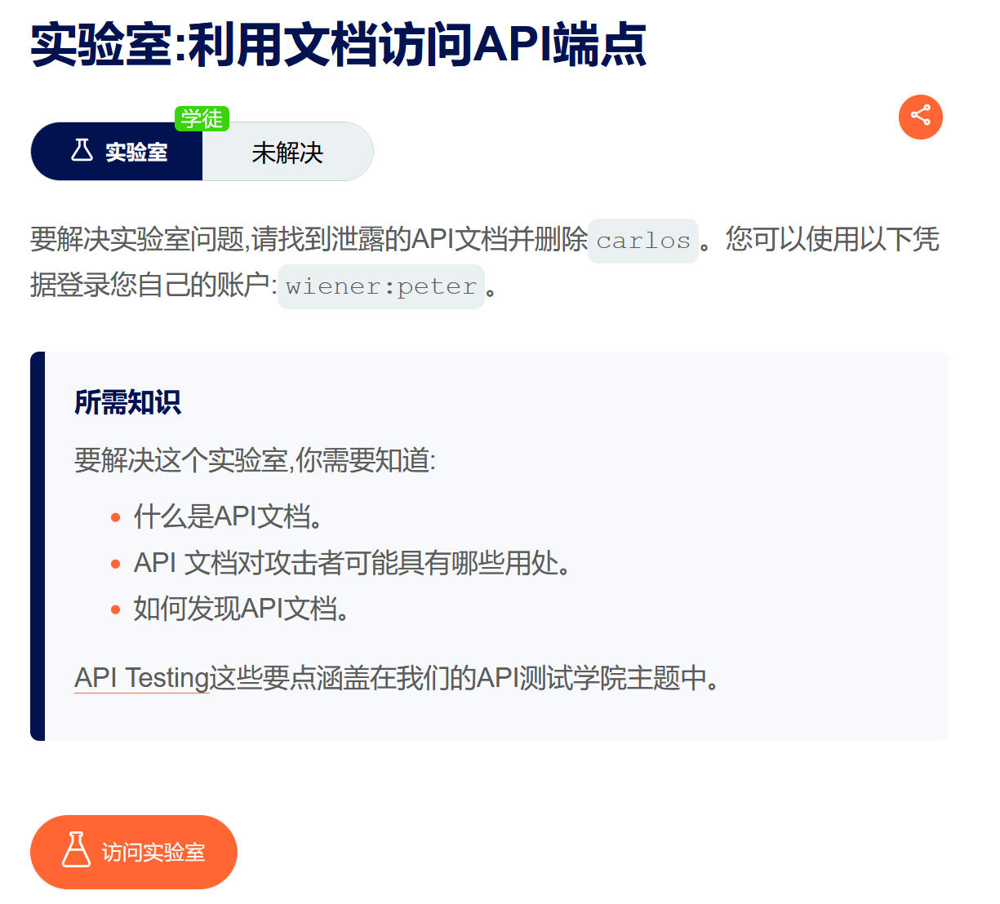
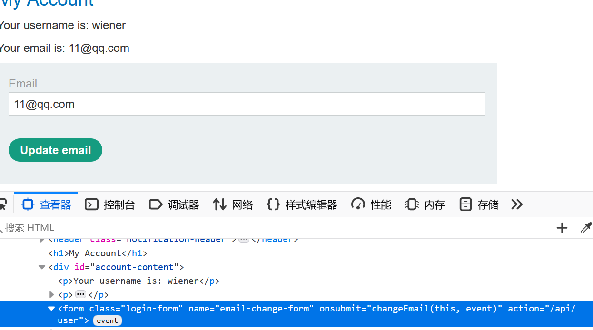
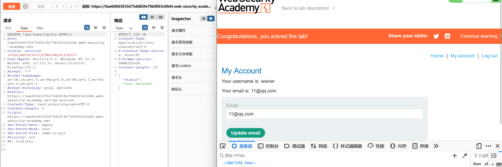
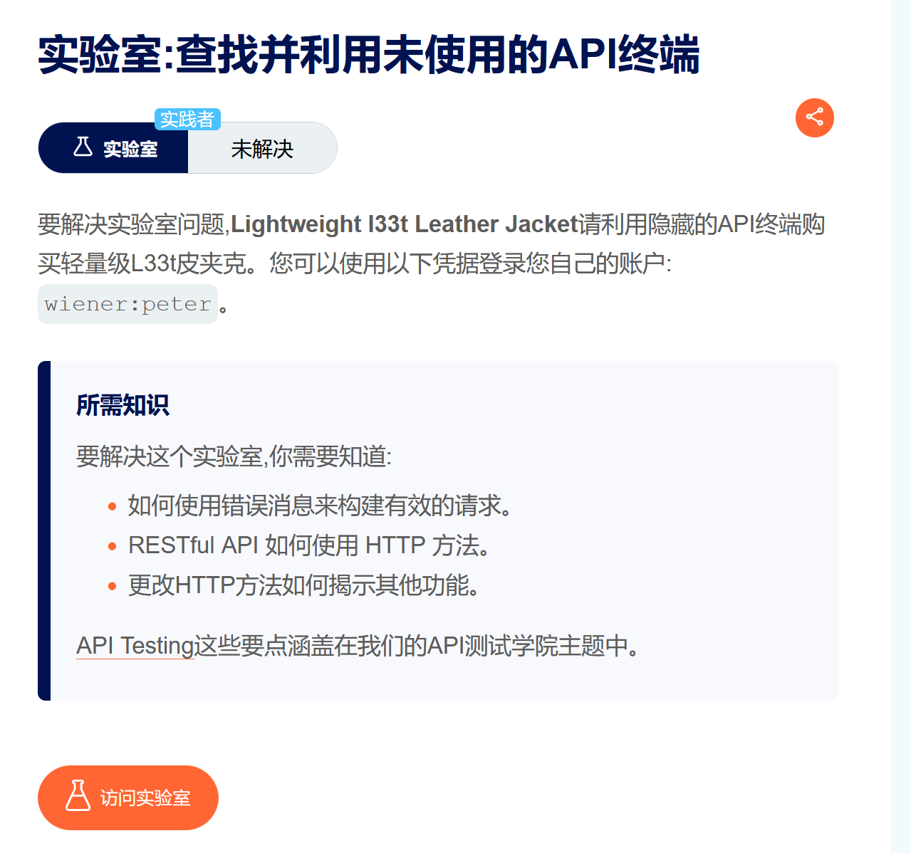

# API测试

## 本质
>API 测试不是独立于 Web 漏洞测试的“新东西”——它本质上是同一套漏洞方法论在 API 接口上的应用。
>
>区别仅在于：传统 Web 测试关注前端交互的入口，API 测试关注后端服务直接暴露的接口。

**API 测试的 3 层递进**

- 第1层：发现	找到所有 API 端点、参数、方法	

- 第2层：理解	弄清楚每个端点接受什么、返回什么、如何认证	

- 第3层：攻击	针对理解到的信息，展开漏洞利用

## API侦查
### 找到API文档

| 路径模式 | 说明 | 常见版本 |
|----------|------|----------|
| `/api` | 基础路径 | 通用 |
| `/swagger/index.html` | Swagger UI 界面 | Swagger 2.0 / 3.0 |
| `/v3/api-docs` | OpenAPI 3.0 JSON | 常见于 Spring Boot |
| `/swagger/v1/swagger.json` | Swagger 2.0 JSON | 通用 |
| `/openapi.json` | OpenAPI 规范 | 通用 |
| `/api-docs` | 常见于 Springfox | 通用 |
| `/docs` | 常见于 Django REST Framework | 通用 |
| `/graphql` | GraphQL 接口 | — |
| `/api/swagger` | 嵌套路径 | 通用 |

>注意：即使找到文档，也别完全相信它。很多团队更新 API 但忘记更新文档，所以文档可能已经过时

### 找到API端点

**方法一**：从JS文件提取（前端 JavaScript 中通常硬编码了 API 调用地址）

- Burp Scanner	自动提取部分端点

- JS Link Finder (BApp)	批量提取 JS 中的 URL

- 手动搜索 fetch(、axios.get(、$.ajax({	定位 API 调用代码

*实战*



找到API端点/api/user



通过该端点实现删除carlos用户



**方法二**：目录/路径爆破
```
# 常见 API 路径前缀
/api/
/api/v1/
/api/v2/
/rest/
/rest/v1/
/graphql/
/rpc/
/soap/
/webservice/

# 资源命名模式（基于业务上下文）
/users
/accounts
/orders
/payments
/admin
/internal
```

**方法三**：从现有请求中推断
```
正常请求：GET /api/v1/users/123
推断路径：/api/v1/users → 可能返回所有用户列表（需要权限）
推断路径：/api/v1/users/123/orders → 可能返回用户订单
推断路径：/api/v1/admin/users → 可能存在管理接口
```

### API交互分析

**识别支持的 HTTP 方法**：一个 API 端点可能支持多种 HTTP 方法，而有些方法没有在文档中公开，但却暴露在服务器上

| HTTP 方法 | 典型用途 | 安全风险 |
|-----------|----------|----------|
| GET | 查询资源 | 信息泄露、IDOR |
| POST | 创建资源 | 注入、越权创建 |
| PUT | 全量更新资源 | 越权修改、Mass Assignment |
| PATCH | 部分更新资源 | Mass Assignment 高风险 |
| DELETE | 删除资源 | 越权删除 |
| OPTIONS | 查询支持的方法 | 暴露攻击面信息 |
| HEAD | 仅返回头信息 | 信息泄露 |
| TRACE | 回显请求内容 | XST 攻击（已基本淘汰） |

*测试方法*

- 对目标端点发送 OPTIONS 请求（服务器不一定正确返回）

- 用 Intruder 的 HTTP 方法列表（GET、POST、PUT、PATCH、DELETE）循环测试

- 观察不同方法的响应：405 Method Not Allowed 表示不支持，200/201/400/500 表示支持

**识别支持的内容类型（Content Type）**

| Content-Type | 常见用途 | 风险 |
|--------------|----------|------|
| `application/json` | RESTful API 主流 | JSON 注入（少见但有） |
| `application/xml` | SOAP 和旧 API | XXE 注入高风险 |
| `application/x-www-form-urlencoded` | 表单提交 | SQL 注入、参数污染 |
| `multipart/form-data` | 文件上传 | 文件上传漏洞 |

*测试方法*

- 修改 Content-Type 头

- 同时转换请求体格式（JSON ↔ XML 等）

- 观察响应变化——如果出现 XML 解析错误或 XXE 特征，说明该端点支持 XML

>实战延伸：某些 API 支持 application/json 和 application/xml 但不会在响应头中声明，只有通过试探才能发现

*实战*




**识别参数（显式和隐式）**

>显式参数：文档中可见的，或请求中已存在的。
>
>隐式参数（Mass Assignment 的根源）

*测试方法*

- 从 GET 响应中枚举字段	如果 GET /api/users/123 返回了 { 
"isAdmin": false }，尝试 PATCH/PUT 时添加该字段

- 从报错信息中提取	错误信息可能暗示了可用的字段名

- 从文档中推断	如果文档提到 User 对象的完整字段列表，尝试在更新请求中添加所有字段

- 从同类型 API 类比	其他类似 API 的参数模式