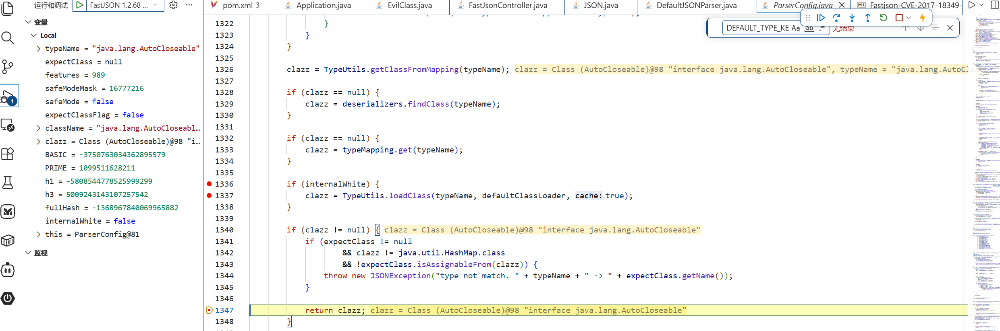
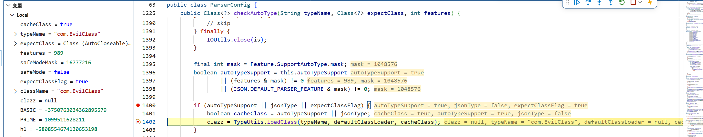
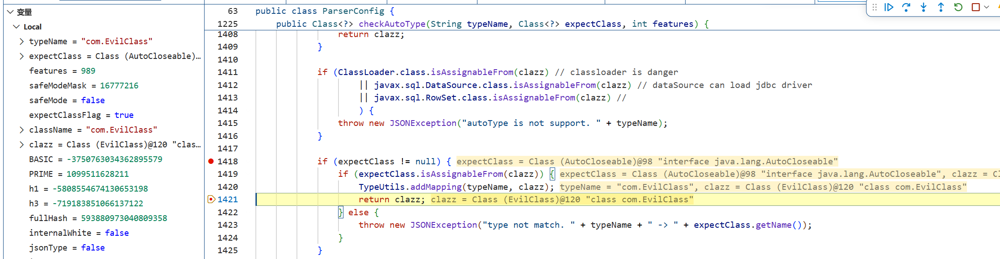

# Fastjson1.2.68

## 核心原理
利用expectClass绕过最后的autoTypeSupport检查

## 源码审计

### 1.2.68中@type的处理逻辑差异
>引入safeMode：完全禁用 @type，彻底关闭反序列化任意类（但默认关闭）
>禁用Class.class的缓存机制

```java
if (clazz == Class.class) {
    return (T) TypeUtils.loadClass(strVal, parser.getConfig().getDefaultClassLoader(), false);
}
```


```java
Class<?> clazz = config.checkAutoType(typeName, null, lexer.getFeatures());
//
//...
if (Map.class.isAssignableFrom(clazz) ) {
    // 如果 @type 指定的是 Map 类型，直接返回
    // 不做反序列化
    continue;
}

```
**追踪config.checkAutoType()**

**阶段一**：safeMode检查

```java
if (safeMode) {
    throw new JSONException("safeMode not support autoType : " + typeName);
}
```

**阶段二：**类名检查，检查类名（基础防御）

```java
if (typeName.length() >= 192 || typeName.length() < 3) {
    throw new JSONException("autoType is not support. " + typeName);
}
```

**阶段三：检查expectClass,设置expectClassFlag**

```java
final boolean expectClassFlag;
if (expectClass == null) {
    expectClassFlag = false;
} else {
    if (expectClass == Object.class
            || expectClass == Serializable.class
            || expectClass == Cloneable.class
            || expectClass == Closeable.class
            || expectClass == EventListener.class
            || expectClass == Iterable.class
            || expectClass == Collection.class
            ) {
        expectClassFlag = false;
    } else {
        expectClassFlag = true;
    }
}
```

**白名单检查、autoTypeSupport、expectClass检查**
```java
if ((!internalWhite) && (autoTypeSupport || expectClassFlag)) {
    long hash = h3;
    for (int i = 3; i < className.length(); ++i) {
        hash ^= className.charAt(i);
        hash *= PRIME;
        if (Arrays.binarySearch(acceptHashCodes, hash) >= 0) {
            clazz = TypeUtils.loadClass(typeName, defaultClassLoader, true);
            if (clazz != null) {
                return clazz;
            }
        }
        if (Arrays.binarySearch(denyHashCodes, hash) >= 0 && TypeUtils.getClassFromMapping(typeName) == null) {
            if (Arrays.binarySearch(acceptHashCodes, fullHash) >= 0) {
                continue;
            }

            throw new JSONException("autoType is not support. " + typeName);
        }
    }
}
```

第一步中AutoCloseable在白名单中跳过该部分
第二步中的恶意类进入该分支
    //遍历计算哈希，检查是否在 acceptHashCodes 或 denyHashCodes 中
    // 假设恶意类不在任何名单中，此循环结束后 clazz == null

**加载类**

```java
clazz = TypeUtils.getClassFromMapping(typeName);

if (clazz == null) {
    clazz = deserializers.findClass(typeName);
}

if (clazz == null) {
    clazz = typeMapping.get(typeName);
}

if (internalWhite) {
    clazz = TypeUtils.loadClass(typeName, defaultClassLoader, true);
}

if (clazz != null) {
    if (expectClass != null
            && clazz != java.util.HashMap.class
            && !expectClass.isAssignableFrom(clazz)) {
        throw new JSONException("type not match. " + typeName + " -> " + expectClass.getName());
    }

    return clazz;
}

```

AutoCloseable在白名单中，在第三个if分支加载然后返回


```java
if (autoTypeSupport || jsonType || expectClassFlag) {
            boolean cacheClass = autoTypeSupport || jsonType;
            clazz = TypeUtils.loadClass(typeName, defaultClassLoader, cacheClass);
        }

```
恶意类的expectClassFlag为true，在该部分加载

```java
if (expectClass != null) {
    if (expectClass.isAssignableFrom(clazz)) {
        TypeUtils.addMapping(typeName, clazz);
        return clazz;
    } else {
        throw new JSONException("type not match. " + typeName + " -> " + expectClass.getName());
    }
}
```
恶意类实现或继承expectClass，成功返回

## 复现RCE
[复现](../../../../practice/cve/Fastjson-CVE-2017-18349/Fastjson-CVE-2017-18349-1.2.68.md)

## POC
```json
"@type":"java.lang.AutoCloseable",
"@type":"EvilClass",
"cmd":"calc"
```

## 调用链
```java

解析 JSON
    │
    ├─ @type: "java.lang.AutoCloseable"
    │   │
    │   └─ checkAutoType("AutoCloseable", null)
    │         │
    │         └─ internalWhite == true
    │               │
    │               └─ TypeUtils.loadClass("AutoCloseable")
    │                     │
    │                     └─ 返回 AutoCloseable.class ✅
    │
    └─ @type: "com.EvilClass"
        │
        └─ checkAutoType("EvilClass", AutoCloseable.class)
              │
              ├─ expectClassFlag = true
              │
              ├─ TypeUtils.getClassFromMapping() → null
              │
              ├─ autoTypeSupport || jsonType || expectClassFlag
              │   └─ TypeUtils.loadClass("EvilClass")   // 兜底加载
              │
              └─ expectClass.isAssignableFrom(clazz)    // true，绕过
                    │
                    └─ 返回 EvilClass.class ✅ → 实例化 → RCE 💥
```

## 追踪方法调用

**AutoCloseable在白名单检查处被加载返回**


**expectClassFlag为true，进入该分支，加载类**


**通过expectClass绕过autoTypeSupport检查，返回恶意类**



