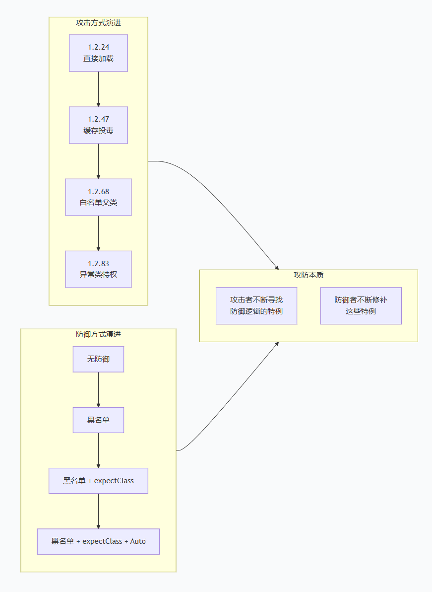

# 三个重要版本对比

| 对比维度 | 1.2.24 | 1.2.47 | 1.2.68 | 1.2.83 |
|----------|--------|--------|--------|--------|
| 核心机制 | 无防御 | 缓存投毒 | expectClass 绕过 | Throwable 特殊处理绕过 |
| 绕过对象 | AutoType 黑名单 | checkAutoType() 黑名单 | expectClass 校验逻辑 | AutoType 关闭限制本身 |
| 核心入口类 | JdbcRowSetImpl | java.lang.Class | AutoCloseable | Throwable 及子类 |
| 触发方式 | dataSourceName 触发 JNDI | 缓存预热 + 二次触发 | 恶意子类构造方法 | 异常类构造方法/setter |
| 防御机制状态 | 无 | 黑名单 | 黑名单 + expectClass | 黑名单 + expectClass + AutoType 默认关闭 |
| CVE 编号 | CVE-2017-18349 | 无 | 无 | CVE-2022-25845 |

## 防御机制

- 升级到 1.2.83 或更高	官方已修复此漏洞	

- 开启 SafeMode	完全禁用 @type，适合 1.2.68+ 用户	

- 使用 FastJSON v2	新版本从头设计，安全性更好	

- 迁移到 Jackson / Gson	默认不开启多态反序列化	

## FastJSON 漏洞演化

>终极演化本质：

》攻击者的每一次进化，都是发现了防御逻辑中的特例分支（缓存例外 → 白名单例外 → 异常类例外）

>防御者的每一次修补，都是缩小这些特例分支的使用范围

>因此，学习 FastJSON 漏洞的关键不是背 POC，而是识别每个版本的"特例在哪里"
