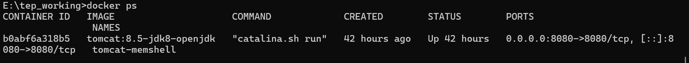
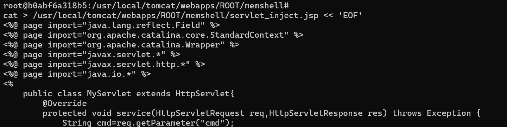
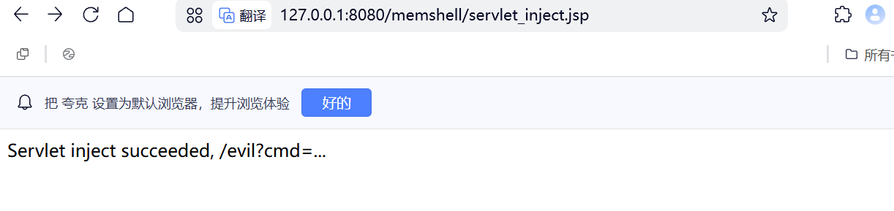
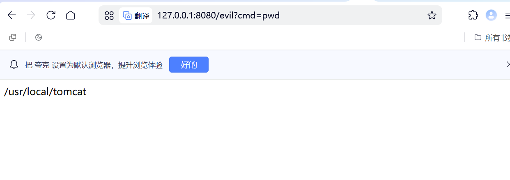
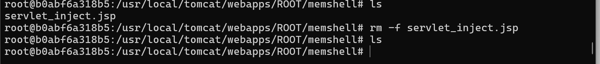
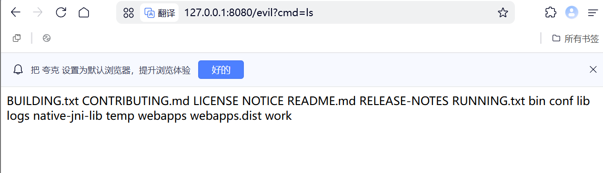
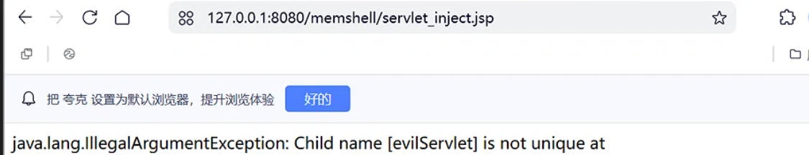

# Servlet型内存马

## Servlet型内存马核心思想
>在应用运行时，通过反射动态创建一个新的 Servlet，并把它绑定到一个 URL 上，使其成为 Tomcat 中一个正常可访问的接口。

这个 Servlet 自带命令执行功能，访问对应的URL 并传入 cmd 参数即可执行系统命令。注入完成后，JSP 注入器可以删除，但 Servlet 仍然存在于内存中，持续生效。

## Servlet的核心作用
在Java Web中Servlet是用来接收HTTP请求并返回响应的核心组件。

**流程**

访问http://xxx.com/hello
```text
1. 请求到达Tomcat

2. Tomcat找到绑定/hello的Servlet

3. Tomcat调用该Servlet的service方法

4. 该Servlet返回响应给用户
```

*Servlet型内存马就是动态注册一个Servlet，让Tomcat把它当做正常组件使用*

## 正常Servlet的注册方式
### 传统web.xml方式
```xml
<servlet>
    <servlet-name>MyServlet</servlet-name>
    <servlet-class>com.example.MyServlet</servlet-class>
</servlet>
<servlet-mapping>
    <servlet-name>MyServlet</servlet-name>
    <url-pattern>/hello</url-pattern>
</servlet-mapping>
```
### 注解方式（Servlet 3.0+）
```java
@WebServlet("/hello")
public class MyServlet extends HttpServlet{
    //...
}
```

### 动态注册（内存马方式）
```java
Wrapper wrapper =context.createWrapper();
wrapper.setServlet(new MyServlet());
context.addChild(wrapper);
context.addServletMappingDecoded("/hello","MyServlet");
```
## Servlet型内存马的的底层原理

**StandardContext**

和Filter型一样，StandardContext是管理Servlet的核心对象

**Wrapper**

Wrapper是Tomcat中管理单个Servlet的容器对象
```
StandardContext（应用上下文）
    ├── children（Map<String, Container>）
    │   └── Wrapper（Servlet 容器）
    │       ├── name: "MyServlet"
    │       ├── servletClass: "com.example.MyServlet"
    │       └── servlet: MyServlet 实例
    └── servletMappings（Map<String, String>）
        └── "/hello" → "MyServlet"
```

**注册步骤**
```
1. 获取StandardContext【反射获取】

2. 创建恶意Servlet组件

3. 创建Wrapper组件

4. 设置Wrapper属性

5. 将Wrapper添加到StandardContext中

6. 绑定URL
```

**触发流程**
```
用户访问 /backdoor?cmd=whoami
    ↓
Tomcat 接收请求
    ↓
查找 servletMappings → "/backdoor" → "EvilServlet"
    ↓
从 children 中获取 Wrapper（EvilServlet）
    ↓
调用 EvilServlet.service()
    ↓
检测到 cmd 参数
    ↓
Runtime.exec() 执行命令
    ↓
返回结果给用户
```
## 优势和局限性

**优势**

- 注册逻辑简单，代码量少

- 回显自然，不存在Listener型无回显的问题

- 正常业务中大量使用Servlet，不易察觉

**局限性**

- URL固定容易被审计发现

- 访问日志中会留下路径＋参数痕迹

- 相比Listener型，隐蔽性低

## 一句话总结
Servlet 型内存马的本质是：利用反射获取 Tomcat 的 StandardContext，动态创建一个 Wrapper 包装恶意 Servlet 并绑定到指定 URL，使其成为 Tomcat 中一个正常的、可访问的接口，实现无文件后门。

## 实战

**环境**:docker 搭建Tomcat8.5容器



**PoC**

[完整注入器代码](../../../code-attachment/memory-shell-code/minidemo/Servlet.jsp)

**注入**




**访问**



**验证不落盘**




### 关键点
1. 名称必须唯一
   Tomcat 的 StandardContext 用 children Map 存储所有 Servlet，Key 就是 Servlet 名称。如果重复添加同名 Servlet，就会抛出 IllegalArgumentException: Child name [xxx] is not unique 
   

2. 如何避免冲突
   
   - System.currentTimeMillis()	用时间戳生成唯一名称

   - UUID.randomUUID()	生成随机 UUID

   -  检查是否已存在	用 sct.findChild(name) 检查后再添加

   - 先删除再添加	用 sct.removeChild(wrapper) 删除旧的 

3. 实战中要用动态路径

    - 每次注入生成不同的路径，增加检测难度

    - 即使被管理员发现一个路径，其他路径仍然隐藏

    - 可以和正常业务路径混在一起，难以区分