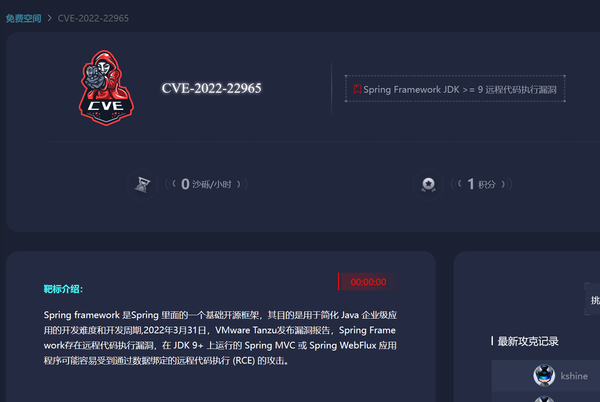
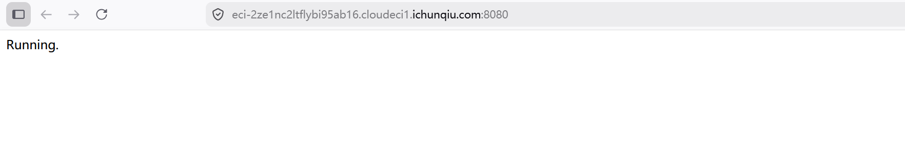
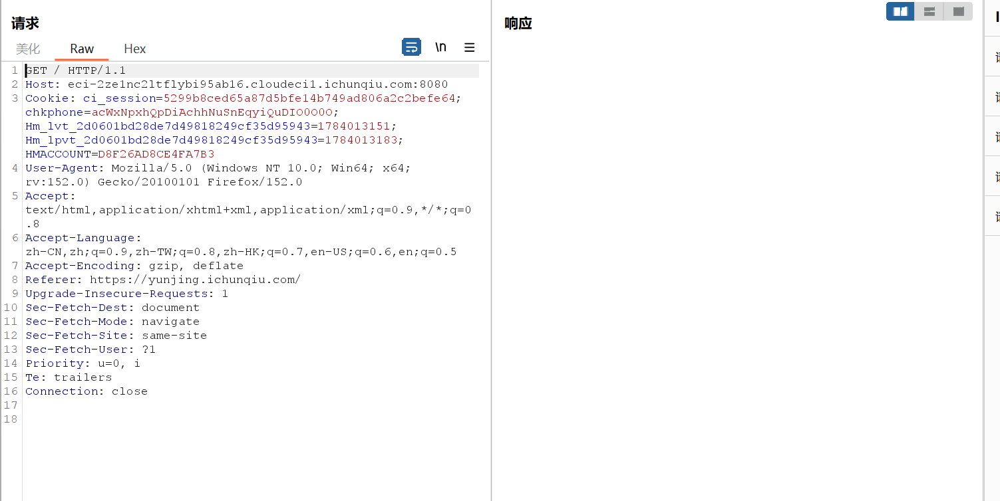
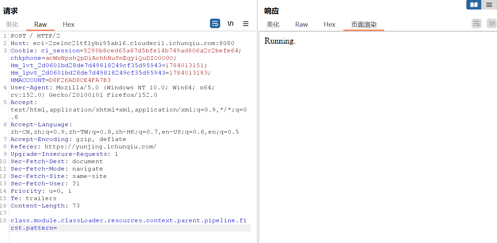
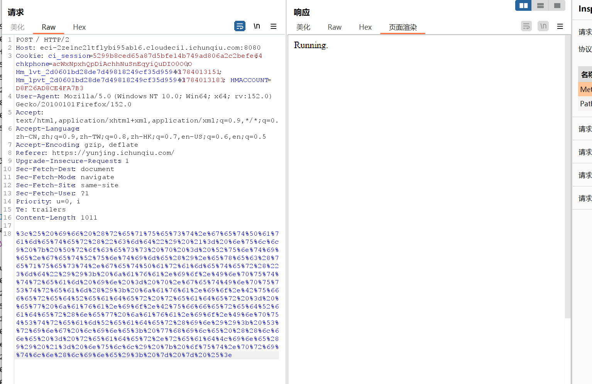

# Spring4Shell远程代码执行复现
## 漏洞利用条件

- jdk9或更高版本

- 使用Spring Framework5.3.0-5.3.17或5.2.0-5.2.19

- 应用被打包成war包并部署在Tomcat上

- 依赖spring-webmvc或spring-webflux

## 核心漏洞点
>Spring的数据绑定机制

- Spring MVC会自动将HTTP请求的参数映射到Controller方法的参数对象上
  ```
    @PostMapping("/greeting")
    public String greeting(User user) {
        // 请求参数 ?name=john&age=25 会自动填充到user对象的name和age字段
        return "Hello " + user.getName();
    }
  ``` 

- 数据绑定支持级联属性赋值，也就是说可以通过点号访问对象深层属性
  
  ```
    POST /greeting
    user.name=john          → 调用 user.setName("john")
    user.address.city=NY    → 调用 user.getAddress().setCity("NY")
  ```

- 关键缺陷：Spring没有对属性链进行充分白名单校验，攻击者可以访问到对象内部的私有属性，包括 ClassLoader 相关的系统级对象。

## 漏洞利用
>利用Spring的数据绑定机制，攻击者通过HTTP参数修改Tomcat的日志组件AccessLogValve的配置，将日志输出目录改为web根目录，将日志内容改为jsp代码，最终生成一个可执行的webshell文件

**阶段一：找到可攻击的系统对象**

`class.module.classLoader.resources.context.parent.pipeline.first`
通过该路径，可以访问到 Tomcat 的日志配置对象

- class → 当前对象（如 User）的 Class 对象

- module → 模块信息（JDK 9+）

- classLoader → 类加载器

- resources → 上下文资源

- context → Web 应用上下文

- parent → 父级上下文（Root Context）

- pipeline → Tomcat 的管道（处理请求的链）

- first → 管道中的第一个阀门（Valve）
  
**阶段二：修改AccessLogValve配置**

- AccessLogValve 是 Tomcat 的访问日志组件，负责记录每次 HTTP 请求的信息到日志文件中
  ```
    public class AccessLogValve {
        private String pattern;     // 日志格式模板
        private String prefix;      // 日志文件名前缀 (默认 "access_log")
        private String suffix;      // 日志文件名后缀 (默认 ".log")
        private String directory;   // 日志输出目录 (默认 "logs/")
        private boolean enabled;    // 是否启用
    }
  ``` 
   - 正常情况下，这些属性只能通过 server.xml 配置，不能运行时修改。

   - 但在漏洞场景下，通过数据绑定，攻击者可以任意修改这些属性！

- 想写入一个 JSP 文件到 Web 根目录，需要控制 4 个参数

    | 属性 | 正常值 | 攻击值 | 作用 |
    |------|--------|--------|------|
    | `pattern` | `%h %l %u %t "%r" %s %b` | JSP 代码 | 定义日志内容（写入恶意代码） |
    | `suffix` | `.log` | `.jsp` | 文件扩展名 |
    | `prefix` | `access_log` | `shell` | 文件名前缀 |
    | `directory` | `logs` | `webapps/ROOT` | 输出目录（Web 根目录） |    

- 攻击请求示例

  ```
    POST /greeting
    class.module.classLoader.resources.context.parent.pipeline.first.pattern=<%Runtime.exec(...)%>
    class.module.classLoader.resources.context.parent.pipeline.first.suffix=.jsp
    class.module.classLoader.resources.context.parent.pipeline.first.prefix=shell
    class.module.classLoader.resources.context.parent.pipeline.first.directory=webapps/ROOT
  ```

**阶段三：访问HTTP触发日志生成**

修改完配置后，Tomcat 不会立即创建新日志文件。需要等待下一次 HTTP 请求触发日志记录

当用户访问任意页面时，Tomcat 会调用
`AccessLogValve.log(request, response)`

此时：

- 根据 pattern 格式化日志内容

- 生成文件名：prefix + 日期 + suffix → shell.jsp

- 将内容写入到 directory 目录 → webapps/ROOT/shell.jsp

*关键点*：pattern 中如果包含 %{User-Agent}i，则会记录请求头中的 User-Agent，攻击者可以把恶意代码放在 User-Agent 中。

## 完整攻击链
```text
恶意HTTP请求
|
Spring数据绑定
|
修改Tomcat日志组件配置
|
再次发送HTTP请求触发日志记录
|
生成可访问的webshell文件
|
访问->RCE
```
## 环境
>i春秋在线靶场



**访问**


## PoC
>关键是把代码进行 URL编码，因为pattern的值在Tomcat中会被解析

**jsp马**

**完整payload**

*内存马-jsp注射器*

*完整payload*

## 打靶过程
**抓包**


**重置原有的日志配置**


**写入恶意JSP代码到日志格式（pattern）**


**设置文件后缀为 .jsp**


## 漏洞的根本原因
1. 过于宽松的属性访问
   
   - 允许访问任意深度的嵌套属性

   - 没有区分"业务属性"和"系统属性"

2. 缺乏黑/白名单机制
   
   - 没有限制哪些属性可以被绑定

   - 攻击者可以访问 classLoader 等敏感对象

3. JDK 9+ 暴露了新攻击面
   
   - module 属性成为攻击链的关键一环

## 修复建议
1. 升级 Spring 版本（根本措施）

   - Spring 5.3.18+ 和 5.2.20+ 中，禁用了对 classLoader 相关属性的绑定：

    ```java
    // 新增的黑名单
    private static final Set<String> DISALLOWED_PROPERTIES = 
        Set.of("classLoader", "contextClassLoader", "module", ...);
    ```
2. 降级 JDK 8

   - 如果业务允许，降级到 JDK 8 可以切断 class.module. 这条攻击链。

3. WAF 防护

   - 拦截包含以下特征的请求：
        ```
        class.module.classLoader

        classLoader.resources.context

        pipeline.first.pattern
        ```
4. Tomcat 配置加固

   - 限制 AccessLogValve 的修改权限

   - 使用 SecurityManager 限制反射访问


